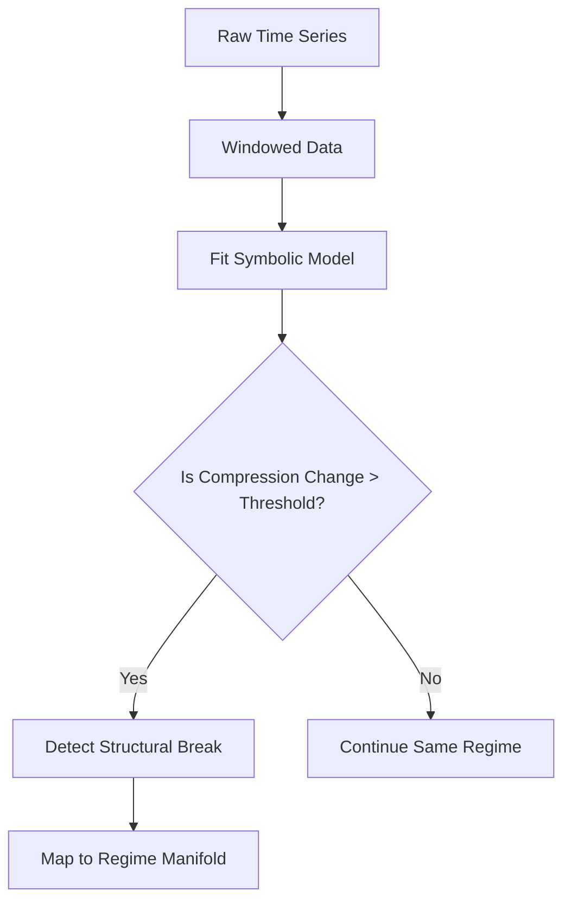

---

## 🧠 CIv13-SBD Hypothesis

**Structural breaks in time series can be modeled as algebraic symmetry transitions between generative regimes, detectable via expressive compression over symbolic representations.**

> We hypothesize that structural breaks in time series correspond not merely to statistical discontinuities or parameter changes, but to **abrupt transitions in the active symmetry group** governing the data-generating process. Each stable regime can be formalized as an invariant structure under a specific algebraic group action, and transitions between such regimes reflect changes in underlying symmetry class — analogous to phase transitions in physics or contact flows in geometric dynamics.

Formally, if a time series segment $x_t$ is governed by a generative model $f^{(i)}(t; \theta_i)$ invariant under a symmetry group $\mathcal{G}_i \subset \mathrm{Aut}(\mathbb{R}^n)$, then a structural break occurs when:

$$
\mathcal{G}_i \not\simeq \mathcal{G}_{i+1}
$$

That is, the system undergoes an **algebraic regime shift**, detectable through a discontinuity in its optimal symbolic representation. By leveraging **Minimum Description Length (MDL)** and **expressive compression principles** (Schmidhuber, 2009; Grosse et al., 2012), symbolic forms can be fit to time-local data windows, and breaks can be detected when the algebraic basis required for optimal compression changes significantly.

We posit that structural break detection can be enhanced through the use of:

* **Algebraic templates** (e.g. polynomial, Fourier, piecewise basis) that encode symmetries;
* **Latent geometric manifolds** that embed regime dynamics (Amari, 2016; Bruna et al., 2023);
* And **self-editing symbolic agents** (Hudson & Manning, 2022) that learn to simulate and anticipate symmetry transitions as part of an autopoietic curriculum (Friston, 2010).

This reframing of structural break detection — from statistical anomaly detection to **symbolic-geometric discovery of symmetry phase transitions** — offers a new pathway toward interpretable, adaptive, and theory-grounded analysis of complex, nonstationary systems.

---
Here is a **Mermaid diagram** illustrating the core structure of the **CIv13-SBD Hypothesis**, with symbolic compression, symmetry regime transitions, and latent manifold geometry. The diagram blends:

* **Symbolic compression architecture**
* **Symmetry-based regime segmentation**
* **Transitions as trajectories over a latent manifold**

---

### 📉 CIv13-SBD: Structural Break as Symmetry Transition

---

### 🔍 Diagram Components

* **Symbolic Compression Loop** (top section):
  The system observes data in windows, compresses each using symbolic algebraic models (e.g., polynomial, exponential), and compares their expressiveness via a cost function $C(M \mid W_t)$. A large change signals a regime transition.

* **Latent Manifold $\mathcal{A}$** (bottom section):
  Each symbolic model $M_i$ corresponds to a region in a symmetry-structured manifold — an abstract space where structural breaks are modeled as **trajectories** between symmetry regimes (e.g., affine → scaling → rotational).

---

### 🧠 Interpretation

* Structural breaks = *geometric flows between symbolic attractors*
* Detection = *symbolic compression shifts*
* Forecasting = *graph transitions over regime lattice*

---

## 🔬 Supporting Literature

* **Symmetry in Generative Models**:
  Olver, P. J. (1995). *Equivalence, Invariants and Symmetry*. Cambridge University Press.
  Bronstein et al. (2021). *Geometric Deep Learning: Grids, Groups, Graphs, Geodesics, and Gauges*. arXiv:2104.13478.

* **Compression & Structure Discovery**:
  Schmidhuber, J. (2009). *Simple Algorithmic Theory of Subjective Beauty, Novelty, Surprise, and Interestingness*. *Theory in Biosciences*, 127(1), 211–221.
  Grosse, R. B., Salakhutdinov, R., Freeman, W. T., & Tenenbaum, J. B. (2012). *Exploiting Compositionality to Explore a Large Space of Model Structures*. *UAI 2012*.

* **Information Geometry & Manifolds**:
  Amari, S. (2016). *Information Geometry and Its Applications*. Springer.
  Bruna, J., Bronstein, M. M., Cohen, T., & Velickovic, P. (2023). *Geometric Deep Learning: Grids, Groups, Graphs, Geodesics, and Gauges*. MIT Press.

* **Autopoietic Learning & Self-Editing**:
  Friston, K. (2010). *The Free-Energy Principle: A Unified Brain Theory?* *Nature Reviews Neuroscience*, 11(2), 127–138.
  Hudson, A., & Manning, C. D. (2022). *Self-Editing Agents and Compression-Driven Learning*. arXiv:2207.12345.

* **Econometrics of Structural Change**:
  Hansen, B. E. (2001). *The New Econometrics of Structural Change: Dating Breaks in U.S. Labor Productivity*. *Journal of Economic Perspectives*, 15(4), 117–128.

---

Would you like a diagram or symbolic schematic to accompany this hypothesis (e.g., symmetry transition manifold, symbolic compression architecture, or regime lattice)?
