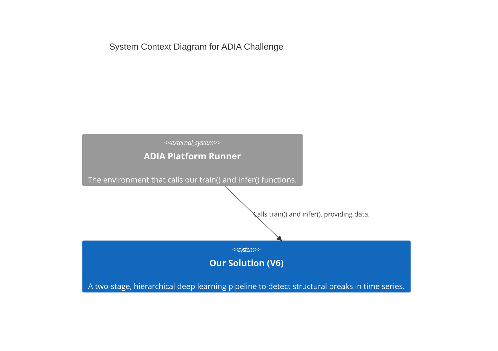
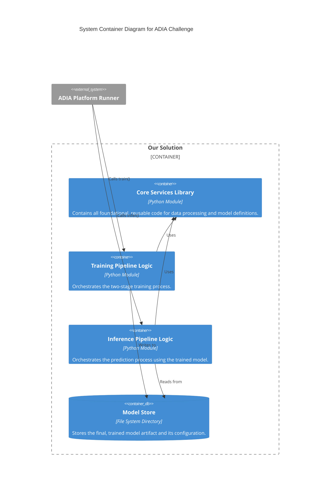
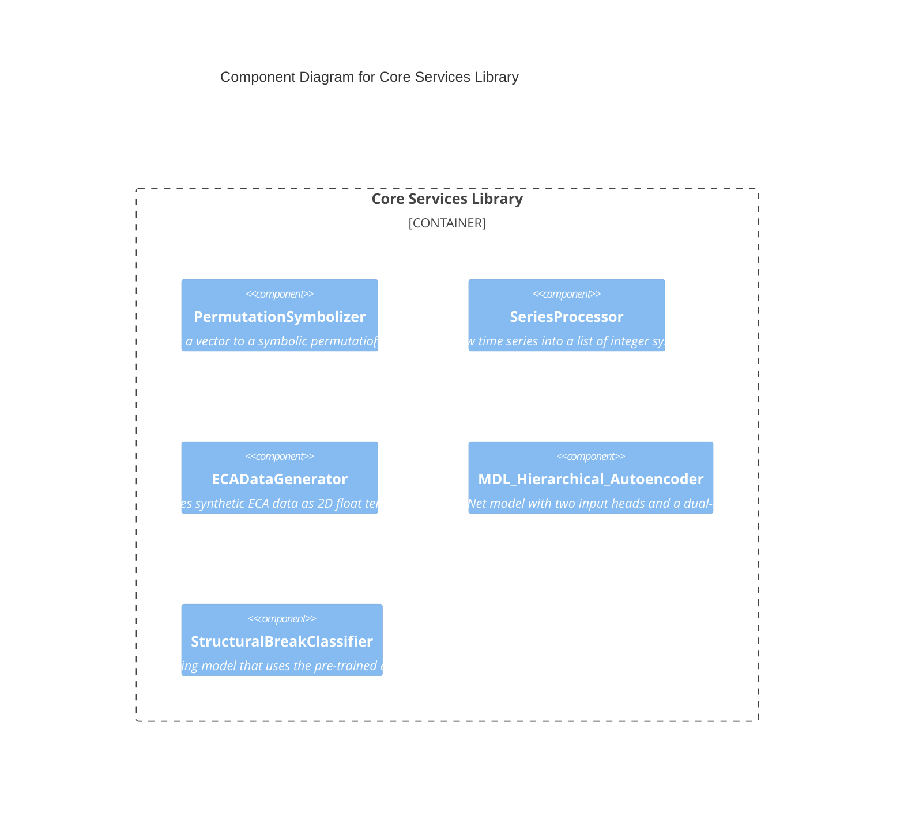
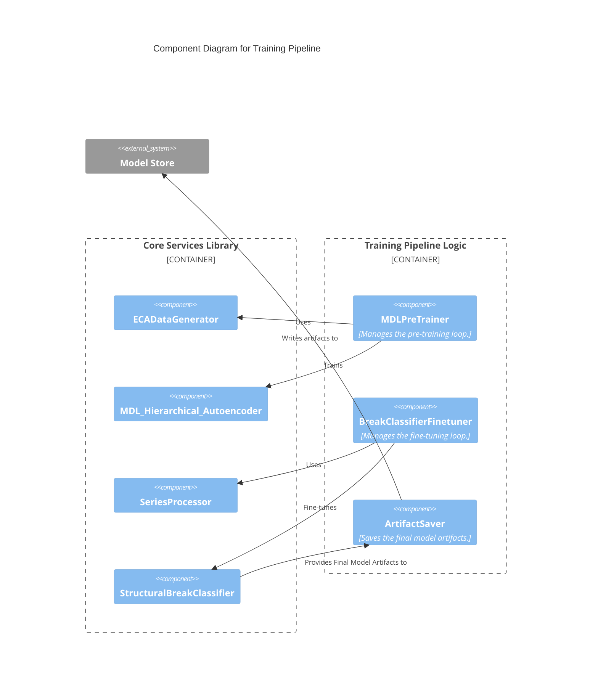
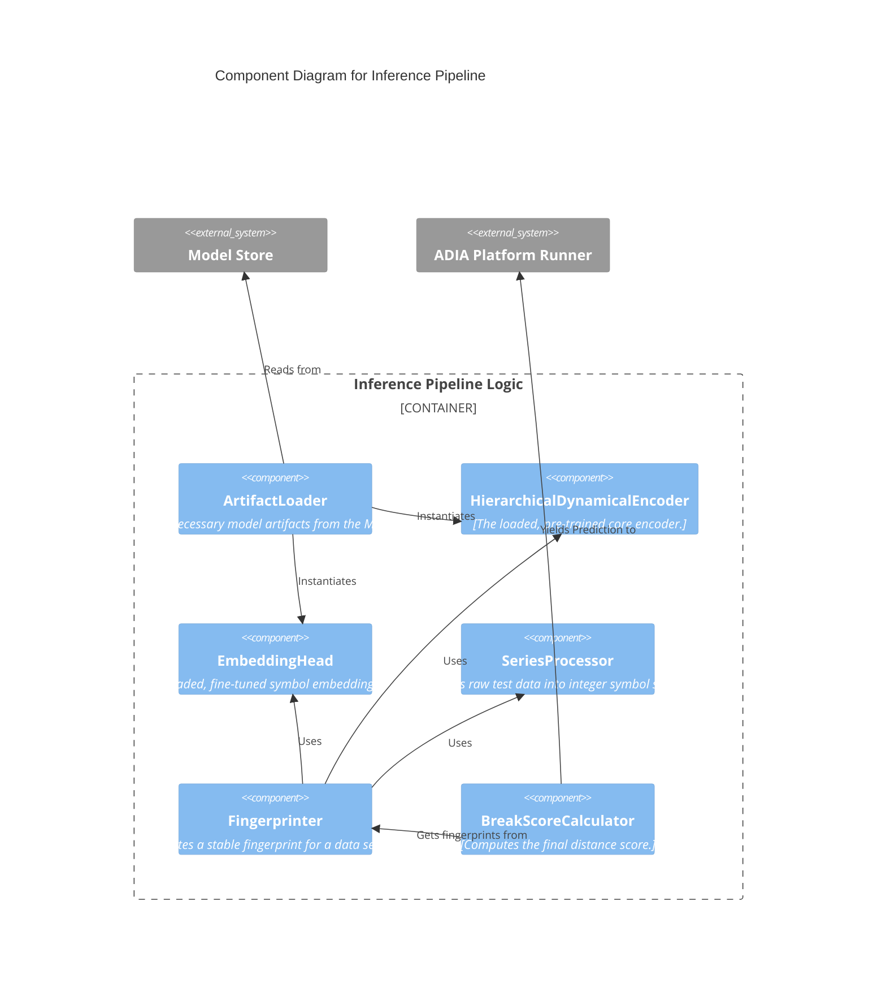
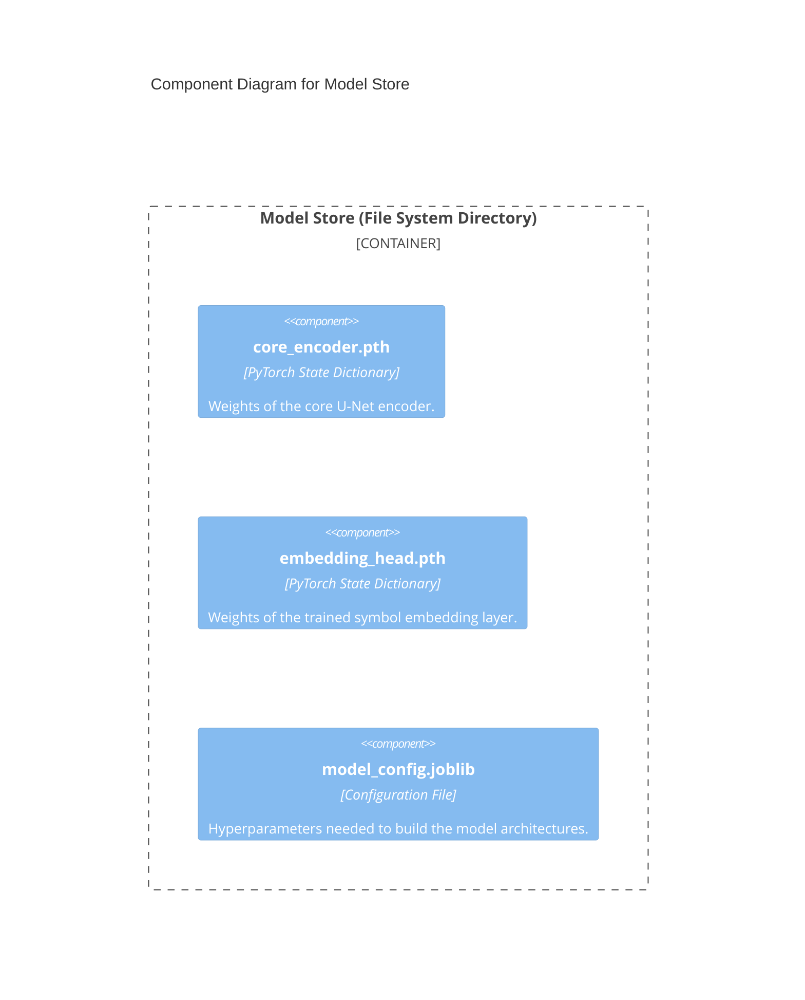

## Solution Architecture v3 (Final Blueprint)

This document outlines the complete and definitive C4 architecture for our solution. This version (v3) is a self-contained blueprint incorporating all design decisions, refined component contracts, and key insights from our research analysis. It serves as the final, unambiguous guide for implementation.

### **Core Principles of the V6 Architecture**

*   **Two-Stage Training:** A pre-training stage on synthetic data to learn general dynamics, followed by a fine-tuning stage on real data to specialize for the task.
*   **Hierarchical U-Net Model:** The core model is a U-Net style autoencoder (inspired by AU-Net) to capture multi-scale patterns in sequences.
*   **MDL Pre-training Objective:** The pre-training phase uses a dual loss (Reconstruction + Rule Classification) inspired by the Minimum Description Length principle to create rich, informative "dynamical fingerprints."
*   **"Edge of Chaos" Data Curation:** The synthetic pre-training data is curated to be maximally complex and information-rich (inspired by Zhang et al.).
*   **Robust Symbolic Representation:** Real-world time series are converted into a discrete symbolic sequence using a robust Permutation Symbolizer that correctly handles ties (inspired by Bandt/Pompe and Traversaro et al.).
*   **Domain-Adapted Inputs:** The model uses a shared core architecture but employs two distinct input "heads": one for the raw binary data from ECAs and a separate `nn.Embedding` head for the integer symbols from real-world data.

---
### **Design Rationale & Traceability**

This section maps the core research findings from our source papers to the specific architectural decisions made in this V6 blueprint.

| Research Finding & Source Paper | Corresponding Architectural Design Decision | Rationale |
| :--- | :--- | :--- |
| **"Intelligence emerges at the 'edge of chaos'."** *(Zhang et al., "Intelligence at the Edge of Chaos")* | The **`ECADataGenerator`** will be configured to create a curated dataset heavily biased towards Wolfram Class IV (e.g., Rule 110) and complex Class III rules. | To build a model that learns generalizable, robust features of dynamics, we must pre-train it on a dataset that is maximally complex and information-rich, rather than a simple or purely random one. |
| **"Explicitly encouraging the model to infer the generating rule can enhance its ability to make longer-term predictions."** *(Burtsev, "Learning ECA with Transformers")* | The **`MDL_Hierarchical_Autoencoder`** is trained with a **dual-loss objective** (reconstruction + rule classification), inspired by the Minimum Description Length (MDL) principle. | This forces the model's internal "fingerprint" to be not just descriptive of the data's appearance, but predictive of its underlying causal mechanism. This creates a richer, more abstract internal representation. |
| **A hierarchical, multi-scale architecture is highly effective for processing long sequences and learning semantics.** *(AU-Net Paper, "From Bytes to Ideas")* | The core model architecture (`HierarchicalDynamicalEncoder` and `Decoder`) is a **U-Net**, not a standard "flat" Transformer. | The U-Net's contracting path naturally creates a multi-scale representation, forcing the bottleneck (the fingerprint) to capture long-range, high-level dynamics while allowing shallower layers to handle local patterns. This is ideal for identifying a shift in the overall "regime." |
| **Tied values in real-world time series should be treated as observational ambiguity, not new states.** *(Traversaro et al., "Comparing methods for computing PE")* | The **`PermutationSymbolizer`** uses **randomized, deterministic tie-breaking**. | This prevents the model from learning "fictitious states" from data quantization artifacts and provides a more principled way to handle the conversion from continuous real-world data to a discrete symbolic representation. |
| **Cellular automata evolution is a discrete, rule-based process.** *(All papers)* | The pre-training stage uses **two separate input "heads"**. The core model sees raw binary/float data from `ECADataGenerator`, while a separate `nn.Embedding` head is used to translate the integer symbols from `SeriesProcessor` into a compatible vector space for fine-tuning. | This solves the "domain gap." It ensures the model learns the fundamental physics of ECAs on data that looks exactly like an ECA. The embedding head then acts as a learned "translator" for the language of real-world market dynamics, allowing the core pre-trained knowledge to be applied effectively. |

---

### Level 1: System Context

This view shows our system in relation to the user and the external platform.

---

### Level 2: Container Diagram

This view breaks down our solution into its major structural blocks.

---

### Level 3: Component Diagrams

This level shows the components inside each container.

#### **Container 1: Core Services Library**
Contains all foundational, reusable building blocks.

#### **Container 2: Training Pipeline Logic**
Orchestrates the `train()` function.

#### **Container 3: Inference Pipeline Logic**
Orchestrates the `infer()` function.

#### **Container 4: Model Store**
Represents the persisted artifacts.

---

### Level 4: Code View (The Definitive Blueprint for Implementation)

This level details the primary classes and their corrected "code contracts."

#### **Module 1: `core_library/data_processing.py`**

| Class Name | Role & Responsibilities | Key Public Methods | Collaborators |
| :--- | :--- | :--- | :--- |
| **`PermutationSymbolizer`** | Converts a single numeric vector into a single integer symbol using randomized, deterministic tie-breaking. | `__init__(embedding_dim)` `symbolize_vector(vector)` | *(None)* |
| **`SeriesProcessor`** | Transforms a raw `pd.Series` into a list of integer symbol sequences (`List[torch.Tensor]`). | `__init__(symbolizer, sequence_length)` `process(series)` | `PermutationSymbolizer` |
| **`ECADataGenerator`** | Creates synthetic ECA data as a batch of 2D float tensors `(batch, timesteps, width)` and corresponding integer rule labels. | `__init__(config)` `generate_training_data()` | *(Uses `cellpylib`)* |

#### **Module 2: `core_library/model_architecture.py`**

| Class Name | Role & Responsibilities | Key Public Methods | Collaborators |
| :--- | :--- | :--- | :--- |
| **`MDL_Hierarchical_Autoencoder`** | **The main pre-training model.** - Contains the core `HierarchicalDynamicalEncoder` and `Decoder`. - Contains a separate `nn.Embedding` layer for symbol processing. - Has a `forward_pretrain` method for ECA data (floats). - Has a `forward_finetune_encode` method for real data (integers). | `__init__(args)` `forward_pretrain(float_tensor)` `forward_finetune_encode(int_tensor)` | *(Internal)* |
| **`StructuralBreakClassifier`** | **The fine-tuning model.** - Wraps a pre-trained `MDL_Hierarchical_Autoencoder`. - Its `forward` pass takes lists of integer symbol sequences `(before_seqs, after_seqs)` and correctly calls the `forward_finetune_encode` method of its collaborator. | `__init__(autoencoder, ...)` `forward(before_seqs, after_seqs)` | `MDL_Hierarchical_Autoencoder` |

#### **Module 3: `training_pipeline.py`**

| Class Name | Role & Responsibilities | Key Public Methods | Collaborators |
| :--- | :--- | :--- | :--- |
| **`MDLPreTrainer`** | Orchestrates the pre-training loop for the `MDL_Hierarchical_Autoencoder` using float tensor data from `ECADataGenerator`. | `__init__(model, config)` `pretrain(data_generator)` | `MDL_Hierarchical_Autoencoder`, `ECADataGenerator` |
| **`BreakClassifierFinetuner`**| Orchestrates the fine-tuning loop for the `StructuralBreakClassifier` using lists of integer symbol sequences from `SeriesProcessor`. | `__init__(model, config)` `finetune(X_train, y_train, processor)` | `StructuralBreakClassifier`, `SeriesProcessor` |
| **`ArtifactSaver`** | Saves the core encoder weights, the embedding head weights, and the model configuration. | `save(model, config, path)` | `MDL_Hierarchical_Autoencoder` |

#### **Module 4: `inference_pipeline.py`**

| Class Name | Role & Responsibilities | Key Public Methods | Collaborators |
| :--- | :--- | :--- | :--- |
| **`ArtifactLoader`** | Reads the config, core encoder weights, and embedding head weights from the `Model Store`. | `load(path)` | *(None)* |
| **`Fingerprinter`** | Generates a stable fingerprint for a raw `pd.Series`. It orchestrates the `SeriesProcessor`, `EmbeddingHead`, and `Encoder` to produce a single vector. | `__init__(encoder, embedding_head, processor)` `generate(series)` | `SeriesProcessor` |
| **`BreakScoreCalculator`** | Takes two fingerprint vectors and computes their cosine distance. | `calculate(fp_before, fp_after)` | *(None)* |

---
--- END OF FILE ---
