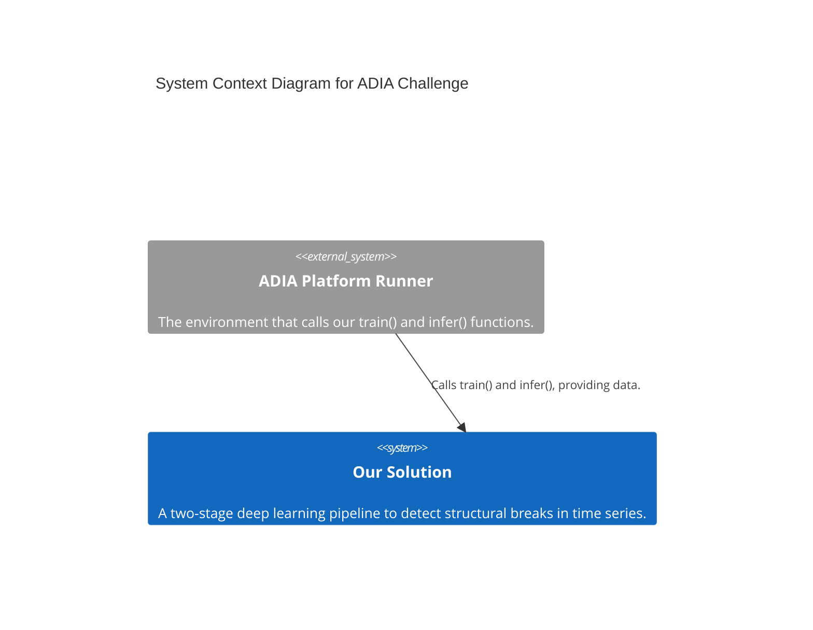
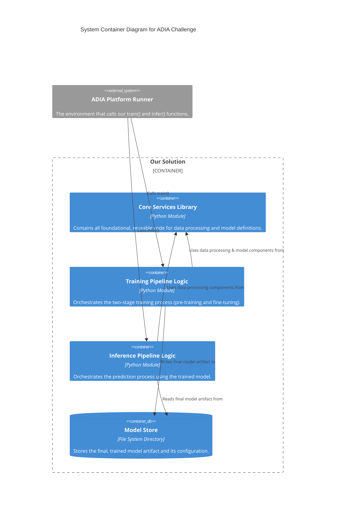
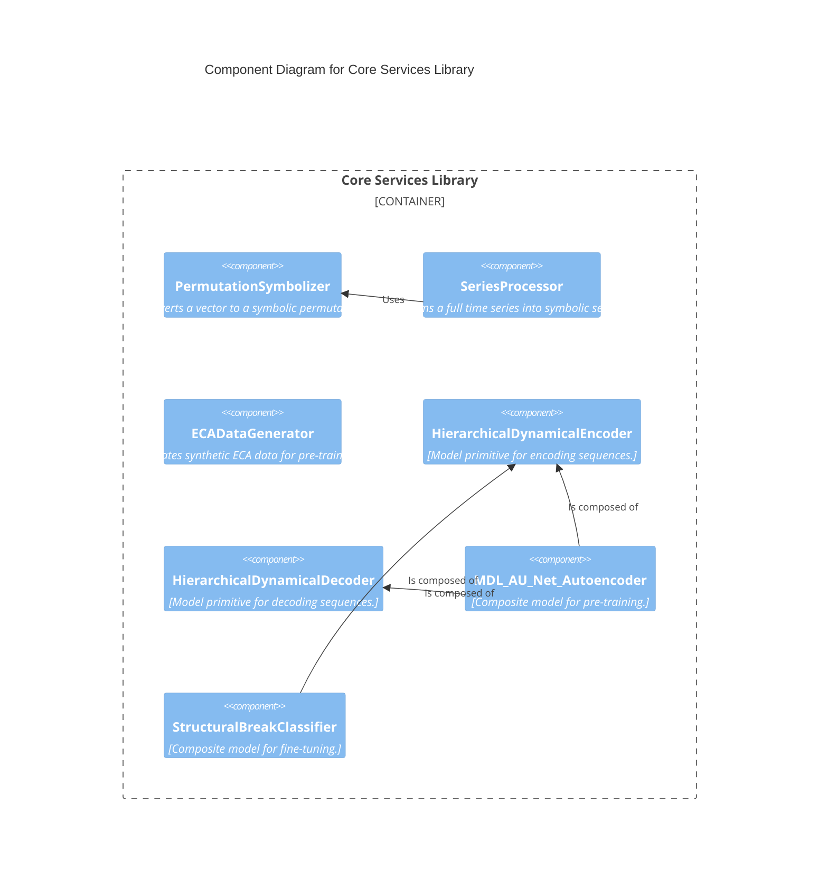
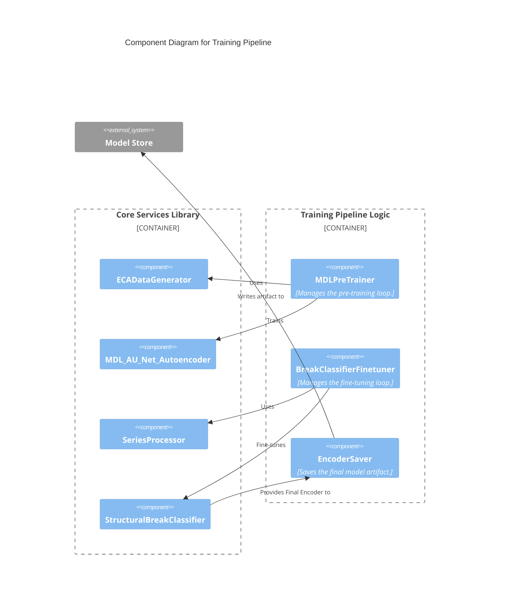
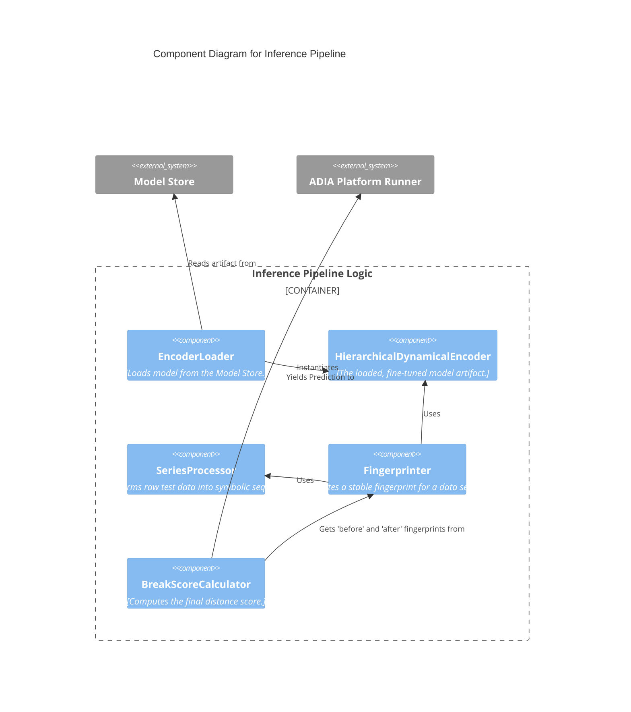
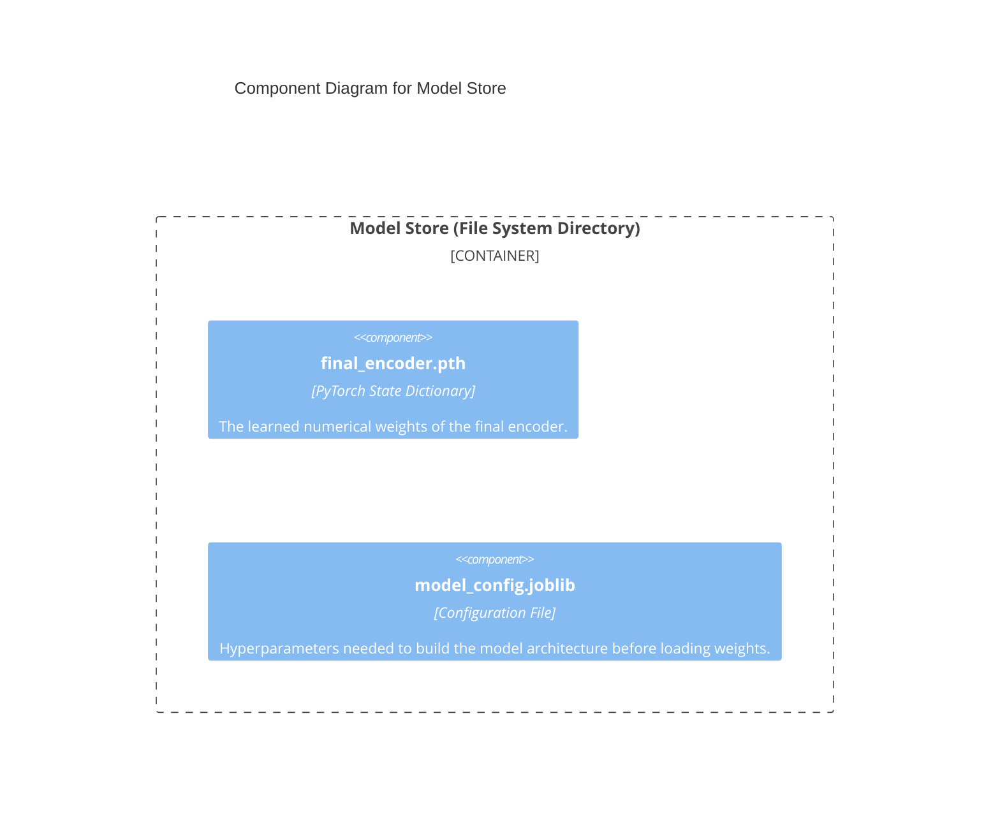

## Solution Architecture v4

This document outlines the complete C4 architecture for our solution to the ADIA challenge. This version (v4) is a self-contained blueprint incorporating all design decisions and corrections, providing a definitive guide for implementation.

### Level 1: System Context

This view shows our system in relation to the user and the external platform. Our solution is a self-contained library that is called by the ADIA Platform Runner, which expects `train()` and `infer()` entrypoints.

### Level 2: Container Diagram

This view breaks down our solution into its major, high-level structural blocks or "containers."

---

### Level 3: Component Diagrams

This level shows the components inside each container.

#### Container 1: Core Services Library

This container holds all the foundational, reusable building blocks of our system.

#### Container 2: Training Pipeline Logic

This container's components are pure **orchestrators** that manage the two-stage training flow.

#### Container 3: Inference Pipeline Logic

This container's components load the final model and use core services to generate predictions.

#### Container 4: Model Store

This container represents the persistence layer (`model_directory_path`).

---

### Level 4: Code View (The Blueprint for Implementation)

This level details the primary classes and their corrected "code contracts."

#### Module 1: `core_library/data_processing.py`

| Class Name | Role & Responsibilities | Key Public Methods | Key Collaborators |
| :--- | :--- | :--- | :--- |
| **`PermutationSymbolizer`** | **Symbolic Converter.** - Converts a single numeric vector into a discrete ordinal pattern symbol. - Uses randomized tie-breaking for robustness. | `__init__(embedding_dim, seed)` `symbolize_vector(vector)` | *(None - Foundational)* |
| **`SeriesProcessor`** | **Real Data Transformer.** - Manages the full pipeline: time-delay embedding, symbolization, and windowing into sequences. - Handles edge cases like series being too short. | `__init__(symbolizer, sequence_length)` `process(series)` | `PermutationSymbolizer` |
| **`ECADataGenerator`** | **Synthetic Data Factory.** - Simulates Elementary Cellular Automata to create a labeled dataset. - Handles composite rules and ensures reproducibility. | `__init__(config)` `generate_training_data()` | *(None - Uses `cellpylib` externally)* |

#### Module 2: `core_library/model_architecture.py`

| Class Name | Role & Responsibilities | Key Public Methods | Key Collaborators |
| :--- | :--- | :--- | :--- |
| **`HierarchicalDynamicalEncoder`** | **Sequence Encoder (Contracting Path).** - A `nn.Module` that compresses a sequence into a final "fingerprint" sequence.  - Its `forward` pass MUST return a tuple: `(fingerprint_sequence, residuals_list)`. | `__init__(args)` `forward(sequence_batch)` | *(None - Primitive)* |
| **`HierarchicalDynamicalDecoder`** | **Sequence Decoder (Expanding Path).** - A `nn.Module` that reconstructs the original sequence. - Its `forward` pass MUST accept two arguments: `(fingerprint_seq, residuals)`. | `__init__(args, transitions)` `forward(fingerprint_seq, residuals)`| *(None - Primitive)* |
| **`MDL_AU_Net_Autoencoder`** | **Pre-training Model.** - A composite `nn.Module` that combines the Encoder, Decoder, and a classification head. - Its internal logic correctly handles the tuple returned by the encoder. | `__init__(args)` `forward(sequence_batch)` `encode(sequence_batch)` | `HierarchicalDynamicalEncoder`, `HierarchicalDynamicalDecoder` |
| **`StructuralBreakClassifier`** | **Fine-tuning Model.** - A composite `nn.Module` that predicts a break from processed `before` and `after` periods. - Its `forward` pass MUST accept two lists of tensors: `(before_seqs, after_seqs)`. - Its internal logic MUST correctly unpack the `(fingerprint, _)` tuple when calling its encoder. | `__init__(encoder, latent_dim, ...)` `forward(before_seqs, after_seqs)` | `HierarchicalDynamicalEncoder` |

#### Module 3: `training_pipeline.py`

| Class Name | Role & Responsibilities | Key Public Methods | Key Collaborators |
| :--- | :--- | :--- | :--- |
| **`MDLPreTrainer`** | **Pre-training Orchestrator.** - Manages the training loop for the `MDL_AU_Net_Autoencoder`. | `__init__(model, config)` `pretrain(data_generator)` | `MDL_AU_Net_Autoencoder`, `ECADataGenerator` |
| **`BreakClassifierFinetuner`** | **Fine-tuning Orchestrator.** - Manages the training loop for the `StructuralBreakClassifier`. - Its implementation must pass lists of tensors to the classifier. | `__init__(model, config)` `finetune(X_train, y_train, processor)`| `StructuralBreakClassifier`, `SeriesProcessor` |
| **`EncoderSaver`** | **Artifact Manager.** - Saves the final fine-tuned encoder and its configuration. | `save(model, config, path)` | `StructuralBreakClassifier` |

#### Module 4: `inference_pipeline.py`

| Class Name | Role & Responsibilities | Key Public Methods | Key Collaborators |
| :--- | :--- | :--- | :--- |
| **`EncoderLoader`** | **Artifact Loader.** - Reads the config and weights from the `Model Store`. | `load(path)` | `HierarchicalDynamicalEncoder` |
| **`Fingerprinter`** | **Vector Generator.** - Orchestrates producing a single, stable fingerprint for a time series segment. - Its implementation must handle lists of sequences and average the resulting fingerprints. | `__init__(encoder, processor)` `generate(series)` | `SeriesProcessor`, `HierarchicalDynamicalEncoder` |
| **`BreakScoreCalculator`** | **Prediction Calculator.** - Takes two fingerprint vectors and computes their cosine distance. | `calculate(fp_before, fp_after)` | *(None - simple math)* |

---
