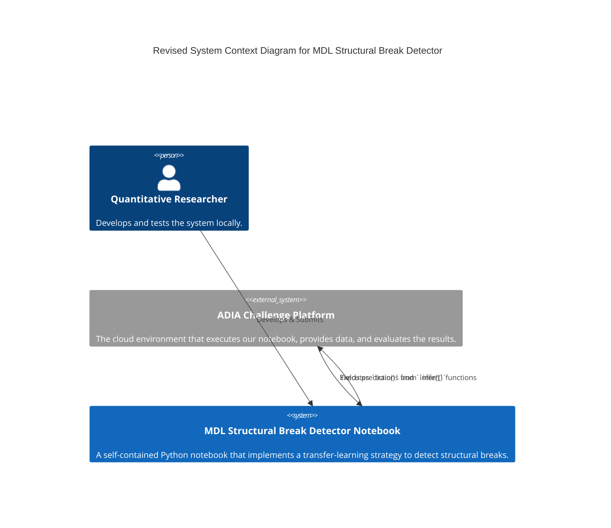
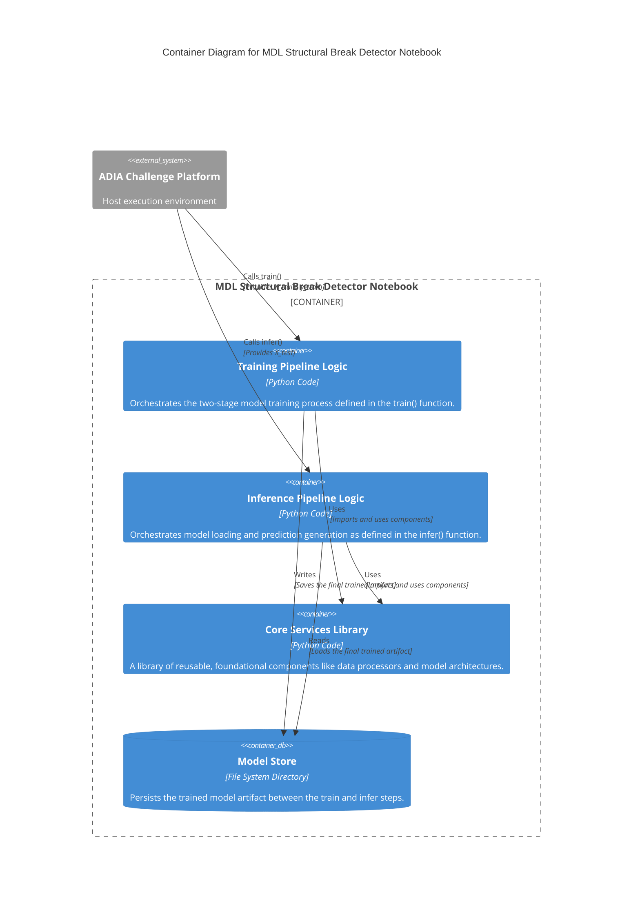
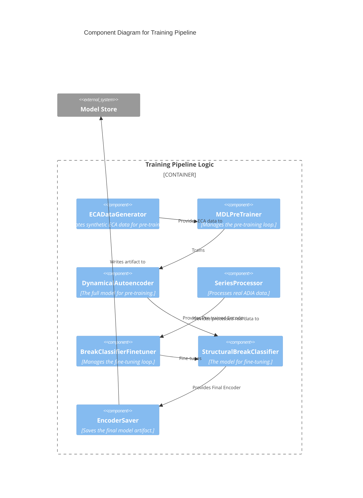
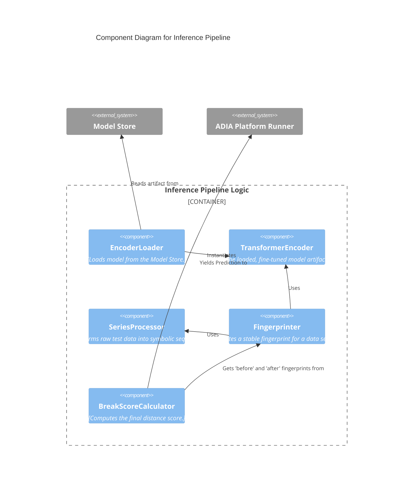
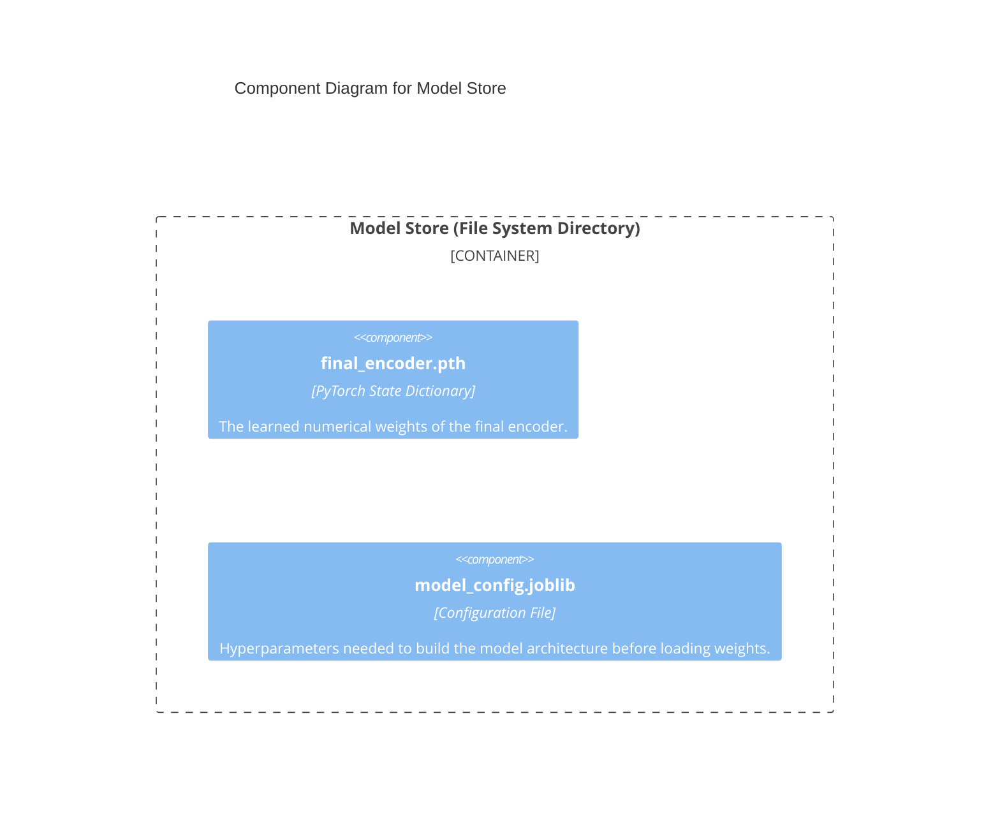

---

### **C4 Architecture: Level 1 - System Context (Revised)**

**Purpose:**
This revised diagram accurately shows that our system is a self-contained notebook which is executed *by* the ADIA platform. The platform is not just a data source, but the host execution environment for our code.

**Scope:**
The system is the notebook itself. Its "user" is the ADIA platform's execution engine, which provides the necessary inputs and consumes the outputs directly.

**Diagram:**



**Revised Elements and Relationships:**

1.  **MDL Structural Break Detector Notebook (Our System):**
    *   **Description:** A self-contained Python notebook that implements a transfer-learning strategy to detect structural breaks.
    *   **Responsibilities:** Encapsulates all logic for data processing, model training (pre-training and fine-tuning), and inference within the `train()` and `infer()` functions as required.

2.  **Quantitative Researcher (Person):**
    *   **Description:** The developer and operator of the system.
    *   **Interaction:** The researcher's primary role is to **Develops & Submits** the notebook file itself. They run the system locally for testing but do not run it on the platform directly.

3.  **ADIA Challenge Platform (External System):**
    *   **Description:** The cloud environment that executes our notebook, provides data, and evaluates the results.
    *   **Revised Interactions:**
        *   **Executes `train()` and `infer()` functions:** The platform is the active agent. It imports our notebook as a module and calls the required functions, providing the data (`X_train`, `y_train`, `X_test`) as arguments in memory.
        *   **Receives Predictions:** Our system doesn't write a file for submission. Instead, the `infer()` function **Yields predictions** one by one directly back to the platform's runner, which collects them for scoring.

---


---

### **C4 Architecture: Level 2 - Container Diagram**

**Purpose:**
The Container Diagram breaks down the overall `MDL Structural Break Detector Notebook` into its major, high-level, logical blocks. These are not necessarily separate files but represent distinct, cohesive areas of responsibility within our single notebook. It shows the primary "moving parts" of our system and how they interact.

**Scope:**
This view focuses on the logical separation of concerns *inside* our notebook. It distinguishes between the training logic, the inference logic, and the persistent model artifact that connects them.

**Diagram:**


---

### **Container Descriptions and Collaborations**

| Container Name | Type | Responsibilities | Key Collaborators |
| :--- | :--- | :--- | :--- |
| **Training Pipeline Logic** | Code Container | - **Orchestrate the `train()` function:** Manage the entire two-stage training flow.<br>- **Execute Pre-training:** Control the generation of synthetic data and the initial training of the `DynamicalAutoencoder`.<br>- **Execute Fine-tuning:** Control the processing of real training data and the fine-tuning of the `StructuralBreakClassifier`.<br>- **Manage Model Persistence:** Ensure the final, trained encoder and its configuration are saved correctly. | - `Core Services Library`: Imports and uses model and data processing components.<br>- `Model Store`: Writes the final trained artifact to it.<br>- `ADIA Challenge Platform`: Is called by the platform and receives `X_train`/`y_train` data from it. |
| **Inference Pipeline Logic**| Code Container | - **Orchestrate the `infer()` function:** Manage the entire prediction generation flow.<br>- **Load the Model:** Control the loading of the trained encoder from the `Model Store`.<br>- **Process Test Data:** Manage the transformation of the incoming `X_test` data stream.<br>- **Generate Predictions:** Use the loaded model to calculate and `yield` the final structural break scores. | - `Core Services Library`: Imports and uses model and data processing components.<br>- `Model Store`: Reads the final trained artifact from it.<br>- `ADIA Challenge Platform`: Is called by the platform, receives `X_test` data from it, and yields predictions back to it. |
| **Core Services Library**| Code Container | - **Provide Foundational Building Blocks:** Define all reusable, core components of the system.<br>- **Define Data Processors:** Contain the classes for synthetic data generation (`ECADataGenerator`) and real data transformation (`SeriesProcessor`, `PermutationSymbolizer`).<br>- **Define Model Architectures:** Contain the `torch.nn.Module` classes for all neural network models (`TransformerEncoder`, `DynamicalAutoencoder`, etc.). | - `Training Pipeline Logic`: Is used by this container.<br>- `Inference Pipeline Logic`: Is used by this container. |
| **Model Store** | Database Container | - **Persist the Trained Artifact:** Act as the durable storage layer connecting the training and inference phases.<br>- **Store Model Weights:** Reliably hold the `.pth` file containing the final encoder's parameters.<br>- **Store Model Configuration:** Reliably hold the `.joblib` file containing the hyperparameters needed to reconstruct the model. | - `Training Pipeline Logic`: Is written to by this container.<br>- `Inference Pipeline Logic`: Is read from by this container. |

This provides a complete and accurate Level 2 view of our system, detailing the responsibilities of each major logical block and how they collaborate. We are now ready to zoom into each of these containers.

---

### **C4 Architecture: Level 3 - Component Diagrams (Cleaned, Corrected, and Comment-Free)**

Here are the universally compatible Mermaid diagrams.

### **Container 1: Training Pipeline Logic**



---

### **Container 2: Inference Pipeline Logic**



---

### **Container 3: Model Store**




---

### **Complete Component Registry**

| Component Name | Container | Role | Responsibilities | Key Collaborators |
| :--- | :--- | :--- | :--- | :--- |
| **ECADataGenerator** | Training Pipeline | Synthetic Data Factory | - Generate Elementary Cellular Automata simulations for a curated set of complex rules.<br>- Slice simulations into `(sequence, rule_label)` pairs for pre-training. | `MDLPreTrainer` |
| **MDLPreTrainer** | Training Pipeline | Pre-training Orchestrator | - Manage the training loop for the autoencoder.<br>- Calculate and apply the dual MDL-inspired loss (reconstruction + classification).<br>- Perform backpropagation to learn general dynamics. | `ECADataGenerator`, `DynamicalAutoencoder` |
| **DynamicalAutoencoder** | Training Pipeline | General Dynamics Model | - Encapsulate the `TransformerEncoder`, `TransformerDecoder`, and a classification head.<br>- Learn to compress and reconstruct ECA sequences during pre-training. | `MDLPreTrainer` |
| **SeriesProcessor** | Training / Inference | Real Data Transformer | - Transform raw ADIA time series into symbolic vector sequences using a `PermutationSymbolizer`.<br>- Handle all windowing, embedding, and batching logic. | `BreakClassifierFinetuner` (in train), `Fingerprinter` (in infer) |
| **BreakClassifierFinetuner**| Training Pipeline | Fine-tuning Orchestrator | - Manage the fine-tuning loop using real `X_train`/`y_train` data.<br>- Calculate and apply the Binary Cross-Entropy loss.<br>- Update weights of the classification head and unfrozen encoder layers. | `SeriesProcessor`, `StructuralBreakClassifier` |
| **StructuralBreakClassifier**| Training Pipeline | Specialized Break Model | - Encapsulate the pre-trained, partially-frozen `TransformerEncoder` and a new classification head designed to predict a break from two fingerprints. | `BreakClassifierFinetuner` |
| **EncoderSaver** | Training Pipeline | Artifact Persistence | - Receive the final, fine-tuned `TransformerEncoder` module and its configuration.<br>- Save the `state_dict` and config to the Model Store. | `StructuralBreakClassifier`, `Model Store` |
| **EncoderLoader** | Inference Pipeline | Artifact Hydration | - Load the encoder `state_dict` and configuration from the Model Store.<br>- Instantiate a `TransformerEncoder` object that is ready for inference. | `Model Store`, `TransformerEncoder` |
| **TransformerEncoder** | Inference Pipeline | The Core Model Artifact | - A `torch.nn.Module` instantiated by the `EncoderLoader`.<br>- Its sole responsibility is to take a batch of symbolic sequences and produce a batch of fingerprint vectors. | `Fingerprinter` |
| **Fingerprinter** | Inference Pipeline | Vector Generator | - Orchestrate the use of the `Encoder` and `SeriesProcessor` to generate a single, stable fingerprint vector for a given time series segment (`before` or `after`). | `TransformerEncoder`, `SeriesProcessor` |
| **BreakScoreCalculator**| Inference Pipeline | Prediction Calculator | - Compute the final `[0,1]` score, typically by calculating the cosine distance between the `before` and `after` fingerprint vectors provided by the `Fingerprinter`. | `Fingerprinter` |
| **final\_encoder.pth** | Model Store | Trained Model Weights | - A binary file containing the learned numerical weights and biases of the final `TransformerEncoder`. | `EncoderSaver`, `EncoderLoader` |
| **model\_config.joblib**| Model Store | Model Architecture Config | - A file storing essential hyperparameters (e.g., `latent_dim`, `model_dim`, `num_layers`) needed to correctly instantiate the `TransformerEncoder` class. | `EncoderSaver`, `EncoderLoader` |

---

Of course. This is the final and most detailed level of the C4 model, where we define the "code contracts" for our components. Each class will be presented with its purpose, key responsibilities, and collaborators, providing a clear blueprint for implementation.

---

### **C4 Architecture: Level 4 - Code View**

This level details the primary classes within each of our logical modules.

---

### **Module 1: `core_library/data_processing.py`**

**Module Purpose:** Contains all classes related to data creation and transformation. These are the foundational building blocks for handling both synthetic and real data.

| Class Name | Role & Responsibilities | Key Collaborators |
| :--- | :--- | :--- |
| **`PermutationSymbolizer`** | **Symbolic Converter.**<br>- Is initialized with an `embedding_dim`.<br>- Its core responsibility is to take a single numeric vector and convert it into a discrete ordinal pattern (permutation symbol), correctly handling ties. | *(None - Foundational)* |
| **`SeriesProcessor`** | **Real Data Transformer.**<br>- Is initialized with a `PermutationSymbolizer` and a `sequence_length`.<br>- Manages the full pipeline for real data: time-delay embedding, symbolization via its collaborator, and windowing into sequences for the model. | `PermutationSymbolizer` |
| **`ECADataGenerator`** | **Synthetic Data Factory.**<br>- Is initialized with a configuration dictionary (`rules_to_use`, `width`, `steps`, etc.).<br>- Responsible for simulating Elementary Cellular Automata and packaging the output into `(sequence, label)` pairs for pre-training. | *(None - Foundational)* |

**Code Skeleton:**
```python
# In core_library/data_processing.py

import numpy as np
import pandas as pd
import torch

class PermutationSymbolizer:
    def __init__(self, embedding_dim: int): ...
    def symbolize_vector(self, vector: np.ndarray) -> np.ndarray: ...

class SeriesProcessor:
    def __init__(self, symbolizer: PermutationSymbolizer, sequence_length: int): ...
    def process(self, series: pd.Series) -> torch.Tensor | None: ...

class ECADataGenerator:
    def __init__(self, config: dict): ...
    def generate_training_data(self) -> tuple[np.ndarray, np.ndarray]: ...
```

---

### **Module 2: `core_library/model_architecture.py`**

**Module Purpose:** Contains all `torch.nn.Module` definitions. These are the structural blueprints for our neural network models.

| Class Name | Role & Responsibilities | Key Collaborators |
| :--- | :--- | :--- |
| **`TransformerEncoder`** | **Sequence Encoder.**<br>- A `nn.Module` primitive.<br>- Takes a sequence of vectors and compresses it into a single "fingerprint" vector. | *(None - Primitive)* |
| **`TransformerDecoder`** | **Sequence Decoder.**<br>- A `nn.Module` primitive.<br>- Takes a fingerprint vector and attempts to reconstruct the original sequence. | *(None - Primitive)* |
| **`DynamicalAutoencoder`** | **Pre-training Model.**<br>- A composite `nn.Module`.<br>- Combines an encoder, a decoder, and a classification head for the dual-loss pre-training stage. | `TransformerEncoder`, `TransformerDecoder` |
| **`StructuralBreakClassifier`** | **Fine-tuning Model.**<br>- A composite `nn.Module`.<br>- Combines a (partially frozen) pre-trained encoder with a new classification head to predict a break from two fingerprints. | `TransformerEncoder` |

**Code Skeleton:**
```python
# In core_library/model_architecture.py

import torch
import torch.nn as nn

class TransformerEncoder(nn.Module):
    def __init__(self, input_dim: int, model_dim: int, num_heads: int, num_layers: int, latent_dim: int): ...
    def forward(self, sequence_batch: torch.Tensor) -> torch.Tensor: ...

class TransformerDecoder(nn.Module):
    def __init__(self, latent_dim: int, model_dim: int, num_heads: int, num_layers: int, output_dim: int): ...
    def forward(self, fingerprint_batch: torch.Tensor, seq_len: int) -> torch.Tensor: ...

class DynamicalAutoencoder(nn.Module):
    def __init__(self, encoder: TransformerEncoder, decoder: TransformerDecoder, num_classes: int, latent_dim: int): ...
    def forward(self, sequence_batch: torch.Tensor) -> tuple[torch.Tensor, torch.Tensor]: ...

class StructuralBreakClassifier(nn.Module):
    def __init__(self, encoder: TransformerEncoder, latent_dim: int, freeze_encoder_body: bool = True): ...
    def forward(self, processed_seq_before: torch.Tensor, processed_seq_after: torch.Tensor) -> torch.Tensor: ...
```

---

### **Module 3: `training_pipeline.py`**

**Module Purpose:** Contains the high-level orchestration logic for the `train()` function.

| Class Name | Role & Responsibilities | Key Collaborators |
| :--- | :--- | :--- |
| **`MDLPreTrainer`** | **Pre-training Orchestrator.**<br>- Manages the training loop for the `DynamicalAutoencoder`.<br>- Uses `ECADataGenerator` to get data.<br>- Calculates and backpropagates the dual MDL loss. | `ECADataGenerator`, `DynamicalAutoencoder` |
| **`BreakClassifierFinetuner`** | **Fine-tuning Orchestrator.**<br>- Manages the training loop for the `StructuralBreakClassifier`.<br>- Uses `SeriesProcessor` to handle real `X_train` data.<br>- Calculates and backpropagates the BCE loss against `y_train`. | `SeriesProcessor`, `StructuralBreakClassifier` |
| **`EncoderSaver`** | **Artifact Manager.**<br>- A simple helper class or function.<br>- Takes the final fine-tuned encoder and its config, and saves them to the `Model Store` directory. | `StructuralBreakClassifier`, `Model Store` (filesystem) |

**Code Skeleton:**
```python
# In training_pipeline.py

import pandas as pd
# Imports from core_library
from .core_library.model_architecture import DynamicalAutoencoder, StructuralBreakClassifier
from .core_library.data_processing import SeriesProcessor, ECADataGenerator

class MDLPreTrainer:
    def __init__(self, model: DynamicalAutoencoder, config: dict): ...
    def pretrain(self, data_generator: ECADataGenerator) -> DynamicalAutoencoder: ...

class BreakClassifierFinetuner:
    def __init__(self, model: StructuralBreakClassifier, config: dict): ...
    def finetune(self, X_train_df: pd.DataFrame, y_train: pd.Series, series_processor: SeriesProcessor) -> StructuralBreakClassifier: ...

class EncoderSaver:
    def save(self, model: nn.Module, config: dict, path: str): ...
```
---

### **Module 4: `inference_pipeline.py`**

**Module Purpose:** Contains the high-level orchestration logic for the `infer()` function.

| Class Name | Role & Responsibilities | Key Collaborators |
| :--- | :--- | :--- |
| **`EncoderLoader`** | **Artifact Loader.**<br>- A helper class or function.<br>- Reads the config and weights from the `Model Store` and instantiates a ready-to-use `TransformerEncoder`. | `Model Store` (filesystem), `TransformerEncoder` |
| **`Fingerprinter`** | **Vector Generator.**<br>- A helper class or function.<br>- Orchestrates the use of `SeriesProcessor` and the loaded `TransformerEncoder` to produce a stable fingerprint for a given time series segment. | `SeriesProcessor`, `TransformerEncoder` |
| **`BreakScoreCalculator`** | **Prediction Calculator.**<br>- A simple helper function.<br>- Takes two fingerprint vectors and computes their cosine distance to get the final `[0,1]` score. | *(None - simple math)* |

**Code Skeleton:**
```python
# In inference_pipeline.py

import typing
import pandas as pd
# Imports from core_library
from .core_library.model_architecture import TransformerEncoder
from .core_library.data_processing import SeriesProcessor

class EncoderLoader:
    def load(self, path: str) -> tuple[TransformerEncoder, dict]: ...

class Fingerprinter:
    def __init__(self, encoder: TransformerEncoder, processor: SeriesProcessor): ...
    def generate(self, series: pd.Series) -> torch.Tensor | None: ...

class BreakScoreCalculator:
    def calculate(self, fp_before: torch.Tensor, fp_after: torch.Tensor) -> float: ...
```

This completes the C4 model, providing a clear, top-to-bottom architectural design from system context down to the specific classes and their responsibilities.


