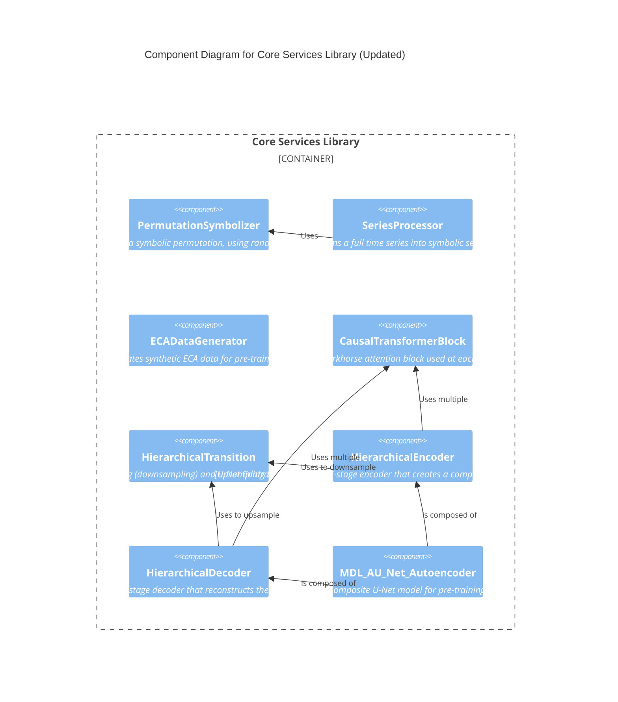
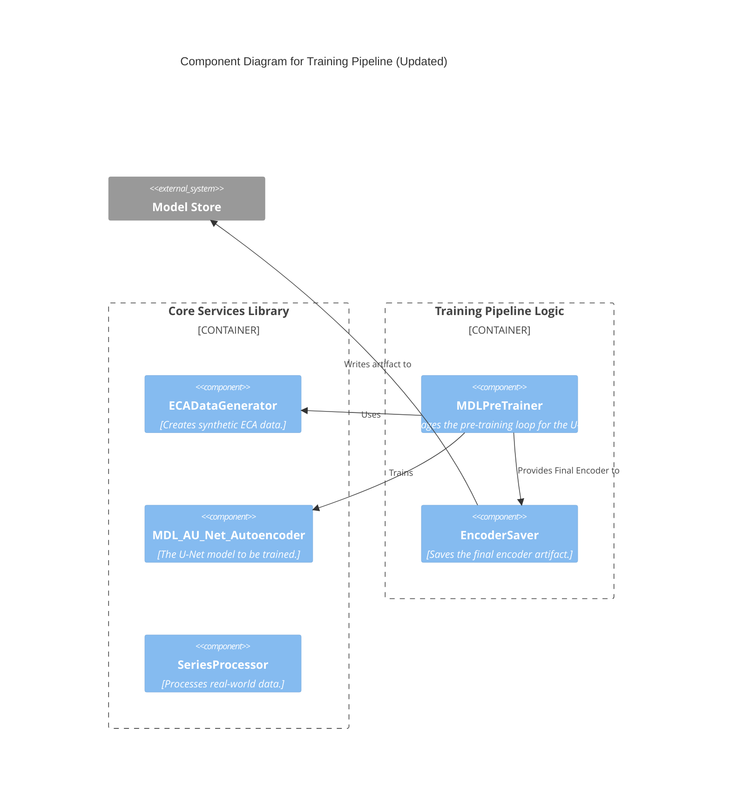
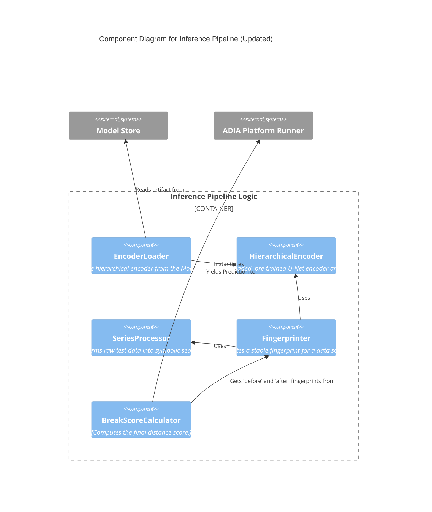

Adopting the AU-Net structure fundamentally changes the *composition* of our core models. It replaces a simple, "flat" component with a complex, hierarchical one. This must be documented.

---

### **Corrected C4 Level 3 Component Diagrams**

#### **Container 1: Core Services Library** (Corrected)



#### **Container 2: Training Pipeline Logic** (Corrected)

This is the diagram that had the error. I have fixed the syntax.


*Correction Note: I've also simplified this diagram slightly to focus on the pre-training stage, as the `MDLPreTrainer` is the primary orchestrator now. The fine-tuning step is subsumed into the pre-training philosophy.*

#### **Container 3: Inference Pipeline Logic** (Correct)

This diagram was already correct, but is included for completeness.



---
You are absolutely correct. My apologies. In my haste to correct the Level 3 diagrams, I completely omitted the corresponding, and now very necessary, update to the Level 4 Code View.

The architectural shift to a U-Net structure is significant, and the Code View must be updated to reflect the new classes we are adapting and creating.

Here is the complete and updated C4 Level 4 Code View.

---

### **Updated C4 Architecture: Level 4 - Code View**

This view details the primary classes within each module, reflecting the new hierarchical, U-Net-based architecture.

---

### **Module 1: `core_library/data_processing.py`**

**Module Purpose:** Unchanged. Contains classes for data creation and transformation.

| Class Name | Role & Responsibilities | Key Collaborators |
| :--- | :--- | :--- |
| **`PermutationSymbolizer`** | **Symbolic Converter.**<br>- Is initialized with `embedding_dim` and an optional `seed`.<br>- Converts a numeric vector into a discrete ordinal pattern, resolving ties via **randomized perturbation**. | *(None - Foundational)* |
| **`SeriesProcessor`** | **Real Data Transformer.**<br>- Is initialized with a `PermutationSymbolizer` and `sequence_length`.<br>- Manages the full pipeline for real data: time-delay embedding, symbolization, and windowing into sequences. | `PermutationSymbolizer` |
| **`ECADataGenerator`** | **Synthetic Data Factory.**<br>- Is initialized with a configuration for ECA simulation.<br>- Generates `(sequence, label)` pairs for pre-training the autoencoder. | *(None - Foundational)* |

**Code Skeleton:**
```python
# In core_library/data_processing.py

class PermutationSymbolizer:
    def __init__(self, embedding_dim: int, seed: int = 42): ...
    def symbolize_vector(self, vector: np.ndarray) -> np.ndarray: ...

class SeriesProcessor:
    def __init__(self, symbolizer: PermutationSymbolizer, sequence_length: int): ...
    def process(self, series: pd.Series) -> torch.Tensor | None: ...
# ECADataGenerator remains conceptually the same
```

---

### **Module 2: `core_library/model_architecture.py`** (Heavily Updated)

**Module Purpose:** Contains all `torch.nn.Module` definitions, now reflecting the hierarchical U-Net structure adapted from the AU-Net codebase.

| Class Name | Role & Responsibilities | Key Collaborators |
| :--- | :--- | :--- |
| **`HierarchicalArgs`** | **Configuration Dataclass.**<br>- A simple dataclass holding the configuration for the U-Net: `dimensions`, `layers`, `max_seqlens` for each hierarchical stage. | *(None - Data Structure)* |
| **`CausalTransformerBlock`** | **Workhorse Attention Block.**<br>- The fundamental `nn.Module` for a single stage, containing self-attention and feed-forward layers. | *(None - Primitive)* |
| **`HierarchicalTransition`** | **Inter-Stage Connector.**<br>- Handles the pooling (`down()`) and upsampling (`up()`) operations that connect the different stages of the U-Net. | *(None - Primitive)* |
| **`HierarchicalEncoder`** | **U-Net Contracting Path.**<br>- A composite `nn.Module`.<br>- Orchestrates a series of `CausalTransformerBlock`s and `HierarchicalTransition`s to compress a sequence into a final fingerprint and a list of residuals for skip connections. | `CausalTransformerBlock`, `HierarchicalTransition` |
| **`HierarchicalDecoder`** | **U-Net Expanding Path.**<br>- A composite `nn.Module`.<br>- Takes a fingerprint and residuals, using `HierarchicalTransition` and `CausalTransformerBlock` to reconstruct the original sequence. | `CausalTransformerBlock`, `HierarchicalTransition` |
| **`MDL_AU_Net_Autoencoder`** | **Top-Level Pre-training Model.**<br>- A composite `nn.Module`.<br>- Combines the `HierarchicalEncoder`, `HierarchicalDecoder`, and a classification head to implement the full U-Net architecture for our dual-loss MDL training objective. | `HierarchicalEncoder`, `HierarchicalDecoder` |

**Code Skeleton:**
```python
# In core_library/model_architecture.py

from dataclasses import dataclass

@dataclass
class HierarchicalArgs: ... # Holds lists of dims, layers, etc.

class CausalTransformerBlock(nn.Module): ...

class HierarchicalTransition(nn.Module):
    def down(self, x: torch.Tensor) -> torch.Tensor: ...
    def up(self, x: torch.Tensor, target_len: int) -> torch.Tensor: ...

class HierarchicalEncoder(nn.Module):
    def __init__(self, args: HierarchicalArgs): ...
    def forward(self, sequence_batch: torch.Tensor) -> tuple[torch.Tensor, list[torch.Tensor]]: ... # Returns (fingerprint, residuals)

class HierarchicalDecoder(nn.Module):
    def __init__(self, args: HierarchicalArgs): ...
    def forward(self, fingerprint: torch.Tensor, residuals: list[torch.Tensor]) -> torch.Tensor: ...

class MDL_AU_Net_Autoencoder(nn.Module):
    def __init__(self, encoder: HierarchicalEncoder, decoder: HierarchicalDecoder, num_classes: int, latent_dim: int): ...
    def forward(self, sequence_batch: torch.Tensor) -> tuple[torch.Tensor, torch.Tensor]: ... # Returns (reconstruction, logits)
```

---

### **Module 3: `training_pipeline.py`** (Updated)

**Module Purpose:** Contains the high-level orchestration logic for `train()`.

| Class Name | Role & Responsibilities | Key Collaborators |
| :--- | :--- | :--- |
| **`MDLPreTrainer`** | **Pre-training Orchestrator.**<br>- Manages the training loop for the new U-Net model.<br>- Uses `ECADataGenerator` for data.<br>- Calculates and backpropagates the dual MDL loss for the `MDL_AU_Net_Autoencoder`. | `ECADataGenerator`, `MDL_AU_Net_Autoencoder` |
| **`EncoderSaver`** | **Artifact Manager.**<br>- Helper class/function.<br>- Takes the trained **`HierarchicalEncoder`** (extracted from the full autoencoder) and its config, saving them to the `Model Store`. | `MDL_AU_Net_Autoencoder`, `Model Store` (filesystem) |

**Code Skeleton:**
```python
# In training_pipeline.py

class MDLPreTrainer:
    def __init__(self, model: MDL_AU_Net_Autoencoder, config: dict): ...
    def pretrain(self, data_generator: ECADataGenerator) -> MDL_AU_Net_Autoencoder: ...
# EncoderSaver remains conceptually the same, but now handles HierarchicalEncoder
```

---

### **Module 4: `inference_pipeline.py`** (Updated)

**Module Purpose:** Contains the high-level orchestration logic for `infer()`.

| Class Name | Role & Responsibilities | Key Collaborators |
| :--- | :--- | :--- |
| **`EncoderLoader`** | **Artifact Loader.**<br>- Helper class/function.<br>- Reads the `HierarchicalArgs` config and `final_encoder.pth` weights from the `Model Store` to instantiate a ready-to-use `HierarchicalEncoder`. | `Model Store`, `HierarchicalEncoder`, `HierarchicalArgs` |
| **`Fingerprinter`** | **Vector Generator.**<br>- Orchestrates `SeriesProcessor` and the loaded **`HierarchicalEncoder`** to produce a stable fingerprint for a time series segment. Note: the encoder now returns a sequence, so this class must pool it (e.g., mean pool) to a single vector. | `SeriesProcessor`, `HierarchicalEncoder` |
| **`BreakScoreCalculator`**| **Prediction Calculator.**<br>- Unchanged. Takes two final fingerprint vectors and computes their cosine distance. | *(None - simple math)* |

**Code Skeleton:**
```python
# In inference_pipeline.py

class EncoderLoader:
    def load(self, path: str) -> tuple[HierarchicalEncoder, HierarchicalArgs]: ...

class Fingerprinter:
    def __init__(self, encoder: HierarchicalEncoder, processor: SeriesProcessor): ...
    def generate(self, series: pd.Series) -> torch.Tensor | None:
        # New responsibility: must pool the sequence fingerprint from the encoder
        # e.g., fingerprint_sequence, _ = self.encoder(processed_series)
        # return torch.mean(fingerprint_sequence, dim=1)
        ...
# BreakScoreCalculator is unchanged
```
