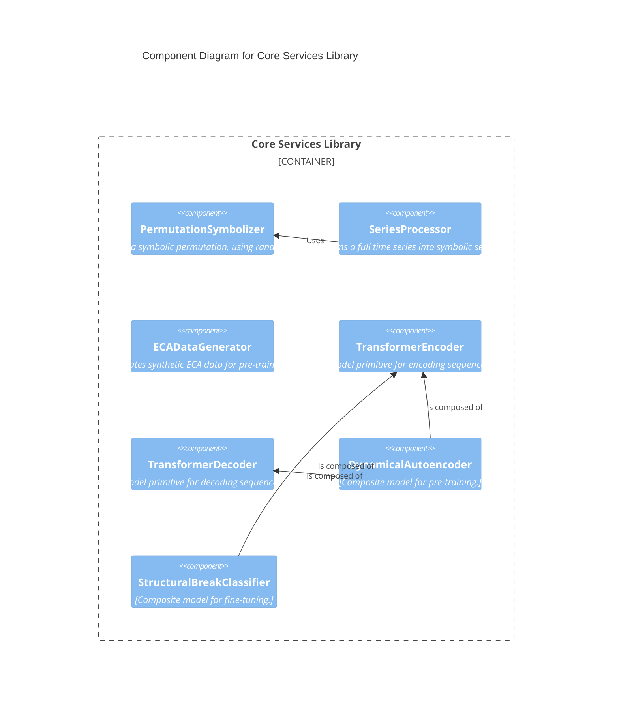
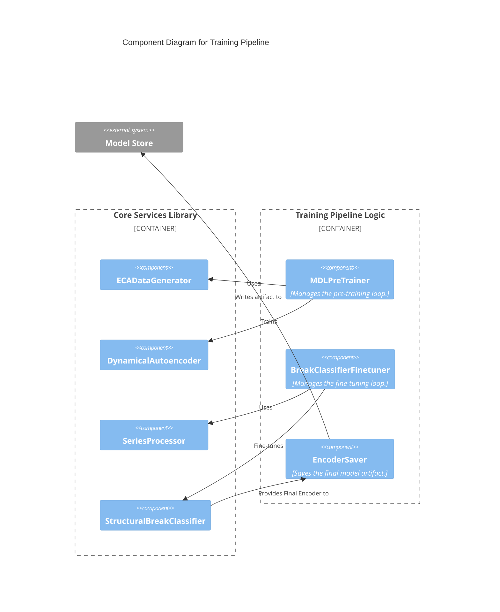
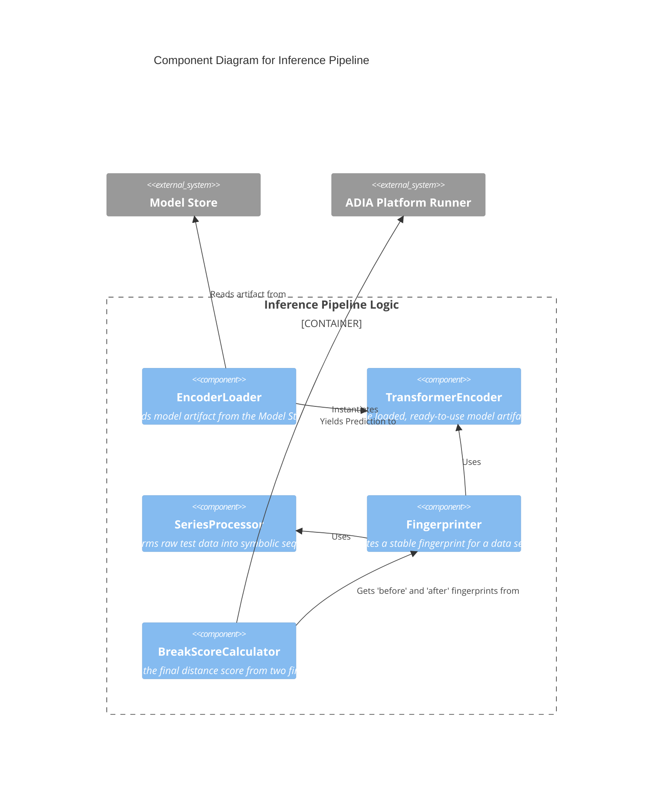
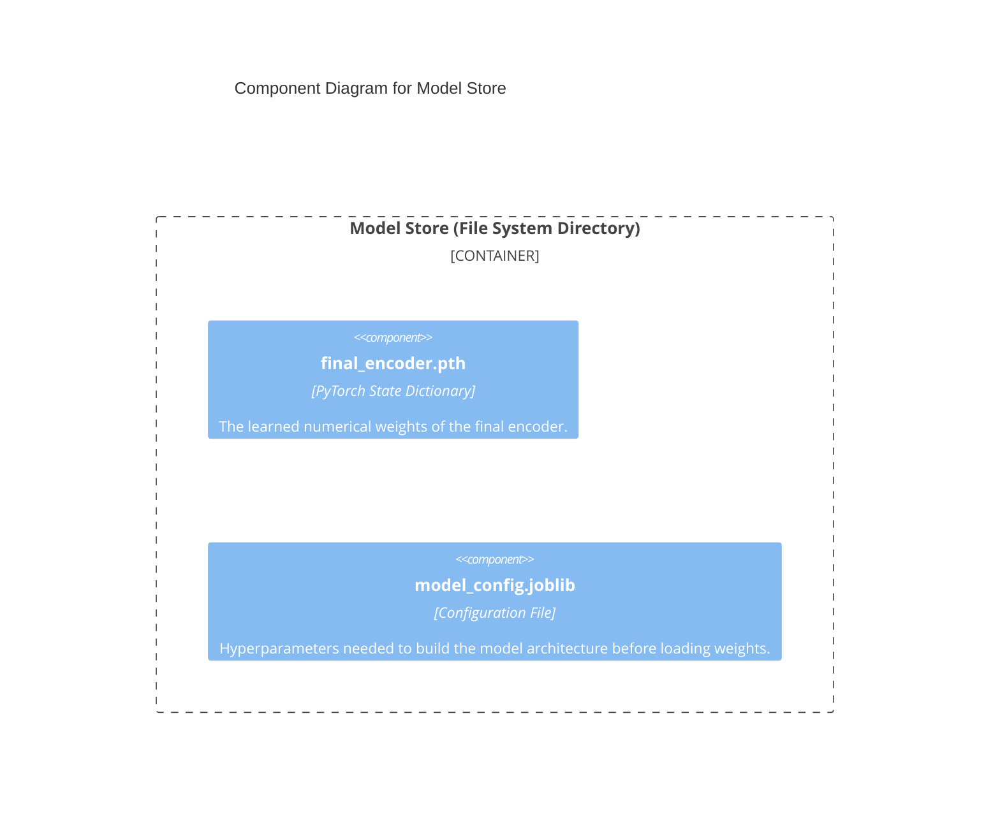

Here is the complete and updated C4 Component (Level 3) and Code (Level 4) documentation, incorporating the **randomized tie-breaking** mechanism. This is designed to be copy-pasted directly to update your `solution-architecture-v2.md` file.

---

### **C4 Architecture: Level 3 - Component Diagrams**

This level zooms into each container defined at Level 2, showing its internal components and their relationships.

---

#### **Container 1: Core Services Library**

**Description:** This container holds all the foundational, reusable building blocks of our system. These components are imported and used by the pipeline containers.



---

#### **Container 2: Training Pipeline Logic**

**Description:** This container's components are pure **orchestrators**. They import components from the `Core Services Library` and manage the two-stage training flow defined within the `train()` function.



---

#### **Container 3: Inference Pipeline Logic**

**Description:** This container's components load the final model and use core services to generate predictions within the `infer()` function.



---

#### **Container 4: Model Store**

**Description:** This container represents the persistence layer (`model_directory_path`). Its components are the actual files stored on disk.



---
---

### **C4 Architecture: Level 4 - Code View**

This level details the primary classes within each of our logical modules, defining their "code contracts."

---

#### **Module 1: `core_library.data_processing`**

**Module Purpose:** Contains all classes related to data creation and transformation.

| Class Name | Role & Responsibilities | Key Collaborators |
| :--- | :--- | :--- |
| **`PermutationSymbolizer`** | **Symbolic Converter.**<br>- Is initialized with an `embedding_dim` and an optional `seed` for reproducibility.<br>- Its core responsibility is to take a numeric vector and convert it into a discrete ordinal pattern. **It resolves ties by adding a small, unique random perturbation to the input before sorting.** | *(None - Foundational)* |
| **`SeriesProcessor`** | **Real Data Transformer.**<br>- Is initialized with a `PermutationSymbolizer` and a `sequence_length`.<br>- Manages the full pipeline for real data: time-delay embedding, symbolization via its collaborator, and windowing into sequences for the model. | `PermutationSymbolizer` |
| **`ECADataGenerator`** | **Synthetic Data Factory.**<br>- Is initialized with a configuration dictionary (`rules_to_use`, `width`, `steps`, etc.).<br>- Responsible for simulating Elementary Cellular Automata and packaging the output into `(sequence, label)` pairs for pre-training. | *(None - Foundational)* |

**Code Skeleton:**
```python
# In core_library/data_processing.py
import numpy as np
import pandas as pd
import torch

class PermutationSymbolizer:
    def __init__(self, embedding_dim: int, seed: int = 42): ...
    def symbolize_vector(self, vector: np.ndarray) -> np.ndarray: ...

class SeriesProcessor:
    def __init__(self, symbolizer: PermutationSymbolizer, sequence_length: int): ...
    def process(self, series: pd.Series) -> torch.Tensor | None: ...

class ECADataGenerator:
    def __init__(self, config: dict): ...
    def generate_training_data(self) -> tuple[np.ndarray, np.ndarray]: ...
```

---

#### **Module 2: `core_library.model_architecture`**

**Module Purpose:** Contains all `torch.nn.Module` definitions.

| Class Name | Role & Responsibilities | Key Collaborators |
| :--- | :--- | :--- |
| **`TransformerEncoder`** | **Sequence Encoder.**<br>- A `nn.Module` primitive.<br>- Takes a sequence of vectors and compresses it into a single "fingerprint" vector. | *(None - Primitive)* |
| **`TransformerDecoder`** | **Sequence Decoder.**<br>- A `nn.Module` primitive.<br>- Takes a fingerprint vector and attempts to reconstruct the original sequence. | *(None - Primitive)* |
| **`DynamicalAutoencoder`** | **Pre-training Model.**<br>- A composite `nn.Module`.<br>- Combines an encoder, a decoder, and a classification head for the dual-loss pre-training stage. | `TransformerEncoder`, `TransformerDecoder` |
| **`StructuralBreakClassifier`** | **Fine-tuning Model.**<br>- A composite `nn.Module`.<br>- Combines a (partially frozen) pre-trained encoder with a new classification head to predict a break from two fingerprints. | `TransformerEncoder` |

**Code Skeleton:**
```python
# In core_library/model_architecture.py
import torch
import torch.nn as nn

class TransformerEncoder(nn.Module):
    def __init__(self, input_dim: int, model_dim: int, num_heads: int, num_layers: int, latent_dim: int): ...
    def forward(self, sequence_batch: torch.Tensor) -> torch.Tensor: ...

class TransformerDecoder(nn.Module):
    def __init__(self, latent_dim: int, model_dim: int, num_heads: int, num_layers: int, output_dim: int): ...
    def forward(self, fingerprint_batch: torch.Tensor, seq_len: int) -> torch.Tensor: ...

class DynamicalAutoencoder(nn.Module):
    def __init__(self, encoder: TransformerEncoder, decoder: TransformerDecoder, num_classes: int, latent_dim: int): ...
    def forward(self, sequence_batch: torch.Tensor) -> tuple[torch.Tensor, torch.Tensor]: ...

class StructuralBreakClassifier(nn.Module):
    def __init__(self, encoder: TransformerEncoder, latent_dim: int, freeze_encoder_body: bool = True): ...
    def forward(self, processed_seq_before: torch.Tensor, processed_seq_after: torch.Tensor) -> torch.Tensor: ...
```

---

#### **Module 3: `training_pipeline`**

**Module Purpose:** Contains the high-level orchestration logic for the `train()` function.

| Class Name | Role & Responsibilities | Key Collaborators |
| :--- | :--- | :--- |
| **`MDLPreTrainer`** | **Pre-training Orchestrator.**<br>- Manages the training loop for the `DynamicalAutoencoder`.<br>- Uses `ECADataGenerator` to get data.<br>- Calculates and backpropagates the dual MDL loss. | `ECADataGenerator`, `DynamicalAutoencoder` |
| **`BreakClassifierFinetuner`** | **Fine-tuning Orchestrator.**<br>- Manages the training loop for the `StructuralBreakClassifier`.<br>- Uses `SeriesProcessor` to handle real `X_train` data.<br>- Calculates and backpropagates the BCE loss against `y_train`. | `SeriesProcessor`, `StructuralBreakClassifier` |
| **`EncoderSaver`** | **Artifact Manager.**<br>- A simple helper class or function.<br>- Takes the final fine-tuned encoder and its config, and saves them to the `Model Store` directory. | `StructuralBreakClassifier`, `Model Store` (filesystem) |

**Code Skeleton:**
```python
# In training_pipeline.py
import pandas as pd
from .core_library.model_architecture import DynamicalAutoencoder, StructuralBreakClassifier
from .core_library.data_processing import SeriesProcessor, ECADataGenerator

class MDLPreTrainer:
    def __init__(self, model: DynamicalAutoencoder, config: dict): ...
    def pretrain(self, data_generator: ECADataGenerator) -> DynamicalAutoencoder: ...

class BreakClassifierFinetuner:
    def __init__(self, model: StructuralBreakClassifier, config: dict): ...
    def finetune(self, X_train_df: pd.DataFrame, y_train: pd.Series, series_processor: SeriesProcessor) -> StructuralBreakClassifier: ...

class EncoderSaver:
    def save(self, model: nn.Module, config: dict, path: str): ...
```
---

#### **Module 4: `inference_pipeline`**

**Module Purpose:** Contains the high-level orchestration logic for the `infer()` function.

| Class Name | Role & Responsibilities | Key Collaborators |
| :--- | :--- | :--- |
| **`EncoderLoader`** | **Artifact Loader.**<br>- A helper class or function.<br>- Reads the config and weights from the `Model Store` and instantiates a ready-to-use `TransformerEncoder`. | `Model Store` (filesystem), `TransformerEncoder` |
| **`Fingerprinter`** | **Vector Generator.**<br>- A helper class or function.<br>- Orchestrates the use of `SeriesProcessor` and the loaded `TransformerEncoder` to produce a stable fingerprint for a given time series segment. | `SeriesProcessor`, `TransformerEncoder` |
| **`BreakScoreCalculator`** | **Prediction Calculator.**<br>- A simple helper function.<br>- Takes two fingerprint vectors and computes their cosine distance to get the final `[0,1]` score. | *(None - simple math)* |

**Code Skeleton:**
```python
# In inference_pipeline.py
import typing
import pandas as pd
from .core_library.model_architecture import TransformerEncoder
from .core_library.data_processing import SeriesProcessor

class EncoderLoader:
    def load(self, path: str) -> tuple[TransformerEncoder, dict]: ...

class Fingerprinter:
    def __init__(self, encoder: TransformerEncoder, processor: SeriesProcessor): ...
    def generate(self, series: pd.Series) -> torch.Tensor | None: ...

class BreakScoreCalculator:
    def calculate(self, fp_before: torch.Tensor, fp_after: torch.Tensor) -> float: ...
```
---
