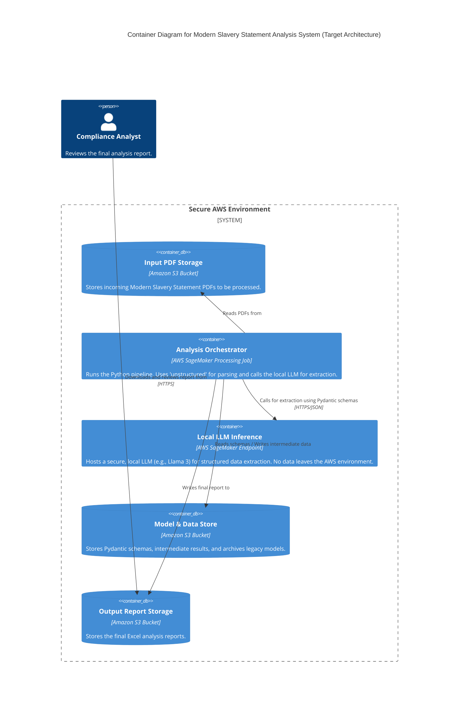
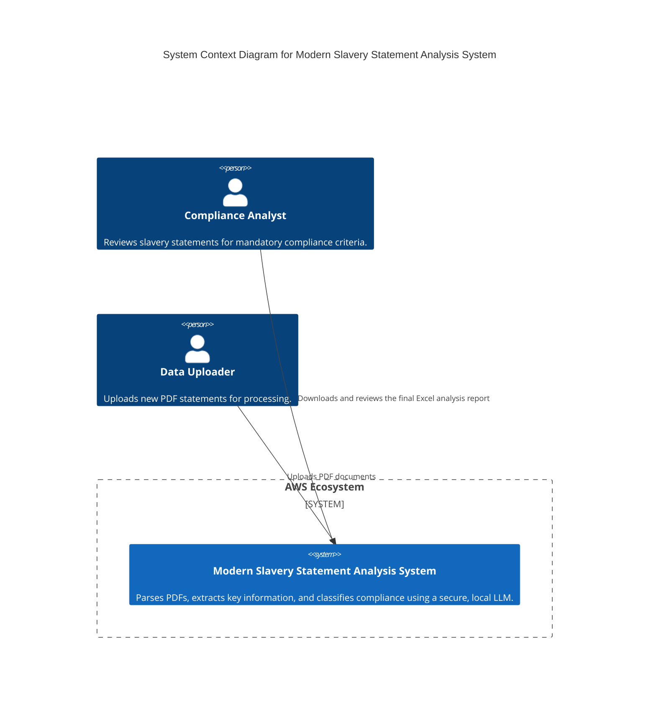
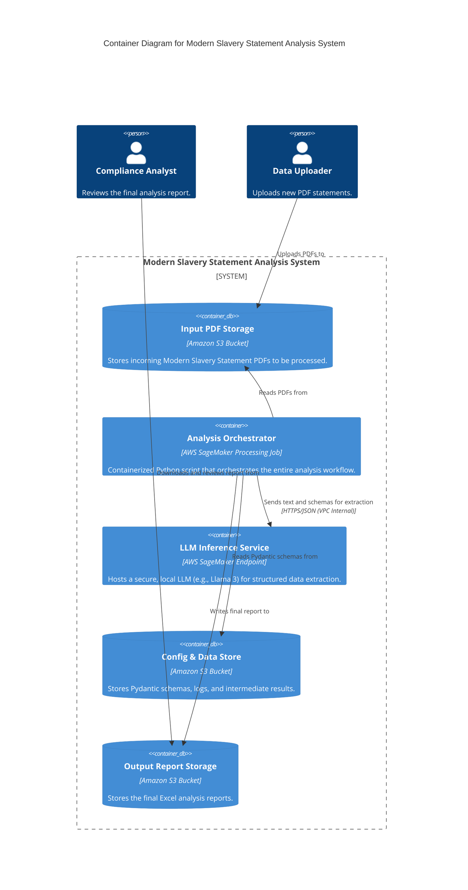
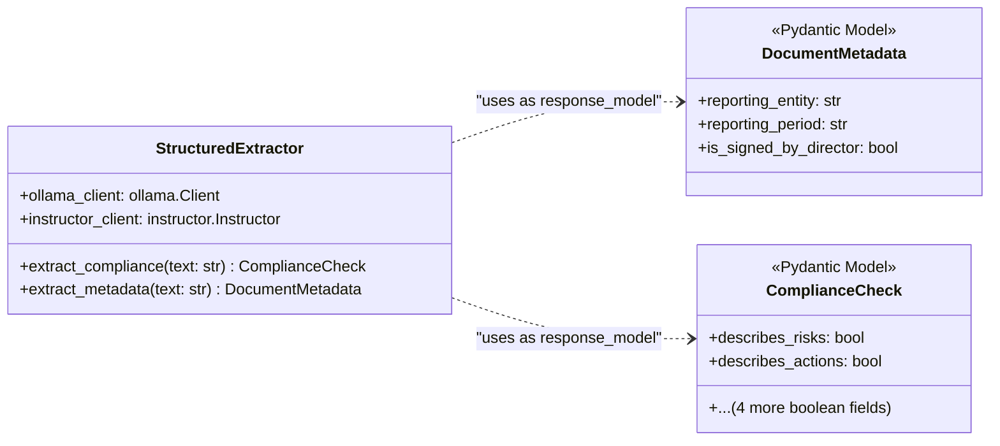

Yes, this makes perfect sense. It is not only a valid question but also the **single most important strategic question** for successfully modernizing a critical system like this. A "big bang" rewrite is too risky; an incremental, controlled migration is the professional approach.

The `agentic-doc` book provides the ideal conceptual framework for this migration. We can use its design patterns to create a target architecture and then map out a step-by-step plan to get there, ensuring each step is verifiable and risk-managed.

Here is the C4 (Level 2: Containers) solution architecture diagram and the migration strategy, designed for your secure AWS SageMaker environment.

---

### C4 Solution Architecture: Modernized Analysis System

This diagram shows the **final, modernized target state** of your system running within a secure AWS environment. The description below will detail how we incrementally evolve your existing codebase to fit this architecture.



### System Overview and Legend

*   **Compliance Analyst:** The end-user who consumes the system's output.
*   **Secure AWS Environment:** The boundary representing your protected cloud infrastructure. No data related to the documents ever leaves this boundary.
*   **Input PDF Storage (S3):** Where new Modern Slavery Statements are uploaded for processing.
*   **Analysis Orchestrator (SageMaker Job):** This is the heart of the system. It's a transient, containerized job that runs your main Python script. In the new architecture, this script is much simpler.
*   **Local LLM Inference (SageMaker Endpoint):** This is a crucial component. Instead of calling a remote API, your SageMaker Job makes a secure, internal network call to a powerful language model that you host yourself on a SageMaker Endpoint. This gives you the "agentic" capabilities without compromising data privacy.
*   **Model & Data Store (S3):** Stores configuration (like Pydantic schemas) and, during the migration, the legacy models (`.lgb`, `.onnx`).
*   **Output Report Storage (S3):** Where the final, structured Excel report is saved for the analyst.

---

Let's build out the complete C4 model for the **Target Architecture** of the modernized Modern Slavery Statement Analysis System.

---

### Level 1: System Context Diagram

This high-level view shows the system as a black box, its users (actors), and its interactions with other systems. It's for everyone, including non-technical stakeholders.


**Description:**
*   The **Data Uploader** provides PDF documents to the system.
*   The **Modern Slavery Statement Analysis System** processes these documents within the secure AWS cloud.
*   The **Compliance Analyst** consumes the final report from the system.

---

### Level 2: Container Diagram

This diagram zooms into the system boundary, showing the high-level technical building blocks (applications, data stores, microservices). This is the diagram I provided previously, now placed in its proper context.


**Description:**
*   This view breaks down the "System" from Level 1.
*   The workflow starts with a **Data Uploader** placing files in an **S3 Bucket**.
*   The **Analysis Orchestrator** (a SageMaker Job) is triggered. It reads the PDF, uses the **LLM Inference Service** (a SageMaker Endpoint) for the "agentic" steps, and writes the final report to another **S3 Bucket**.
*   All processing happens securely within your AWS Virtual Private Cloud (VPC).

---

### Level 3: Component Diagram

This diagram zooms into a single container, the **Analysis Orchestrator**, to show its internal components. This is for developers who need to understand the codebase structure.

This view is critical for showing the **migration path**, as it explicitly visualizes the legacy components being replaced by modern ones.

```mermaid
C4Component
    title Component Diagram for Analysis Orchestrator

    Container(sagemaker_endpoint, "LLM Inference Service")
    ContainerDb(input_s3, "Input PDF Storage")
    ContainerDb(output_s3, "Output Report Storage")

    System_Boundary(orchestrator, "Analysis Orchestrator") {
        Component(main, "main.py", "Main Script", "Orchestrates the workflow: loads data, calls components, saves results.")

        Component(pdf_parser, "PDF Parser", "Python / unstructured", "Parses PDF layout and extracts semantic chunks (text, tables). Replaces the legacy 'textification.py'.")
        Component(extractor, "Structured Extractor", "Python / instructor", "Formats requests and sends text to the LLM Service to populate Pydantic models. Replaces 14 legacy models.")
        Component(reporter, "Report Generator", "Python / pandas", "Assembles the final ParsedDocument object and generates the Excel report.")

        System_Boundary(legacy, "Legacy Components (To Be Decommissioned)") {
            Component(legacy_ocr, "Legacy OCR", "textification.py", "DEPRECATED: Old Tesseract-based text extraction.")
            Component(legacy_ner, "Legacy Entity ID", "entidentification.py", "DEPRECATED: Custom models for finding company names.")
            Component(legacy_sig, "Legacy Signature ID", "signitraction.py", "DEPRECATED: Custom models for finding signatures.")
            Component(legacy_class, "Legacy Classifiers", "classification.py", "DEPRECATED: 12 models for compliance checks.")
        }
    }

    Rel(main, pdf_parser, "Uses")
    Rel(main, extractor, "Uses")
    Rel(main, reporter, "Uses")

    Rel(pdf_parser, input_s3, "Reads PDF from")
    Rel(extractor, sagemaker_endpoint, "Makes secure internal API call to")
    Rel(reporter, output_s3, "Writes .xlsx file to")

    ' Dashed lines show legacy components being phased out
    Rel_D(main, legacy_ocr, "Replaces")
    Rel_D(main, legacy_ner, "Replaces")
    Rel_D(main, legacy_sig, "Replaces")
    Rel_D(main, legacy_class, "Replaces")
```
**Description:**
*   The **`main.py`** script is the entry point.
*   **Modern Components:**
    *   **PDF Parser:** A component built around the `unstructured` library. It's the replacement for your old OCR.
    *   **Structured Extractor:** A component built around the `instructor` and `ollama` (or SageMaker SDK) libraries. It's the replacement for ALL your custom entity, signature, and classification models.
    *   **Report Generator:** This component is likely to remain similar, but now it consumes the clean `ParsedDocument` object instead of messy, disparate data.
*   **Legacy Components:** The diagram explicitly shows the old modules being encapsulated and marked for deprecation, illustrating the migration path.

---

### Level 4: Code Diagram (Optional)

This level is a UML class diagram or similar, showing the code-level details of a specific component. It's useful for detailed implementation discussions. Let's create one for the **Structured Extractor** component, as it embodies the core "agentic design pattern".


**Description:**
*   This shows the **Structured Extractor** class.
*   It has methods like `extract_compliance()` that take raw text as input.
*   Crucially, the return type of these methods is not a simple string or boolean, but a fully populated **Pydantic Model** (`ComplianceCheck` or `DocumentMetadata`).
*   The `instructor` library handles the magic of ensuring the LLM's output conforms to this Pydantic schema. This is the code-level implementation of the "agentic design pattern" for structured extraction.

This complete four-level C4 model provides a comprehensive, multi-layered view of your target architecture and clearly maps out the incremental path to get there, satisfying the needs of all stakeholders from business analysts to software developers.

---
### Risk-Managed Migration Strategy: From Legacy to Agentic

This strategy uses the patterns from the book to encapsulate and incrementally replace your legacy components. The entire process happens within the `Analysis Orchestrator` container.

#### Phase 0: "As-Is" State

*   **Current Situation:** Your existing monolithic Python script, with all its custom models and dependencies, runs inside the `Analysis Orchestrator` (SageMaker Job). It reads models from the `Model & Data Store` and produces an Excel file.

#### Phase 1: Encapsulate with the `ParsedDocument` Pattern

This is the first, lowest-risk step. We don't replace anything yet; we just adopt the primary design pattern from the book.

1.  **Introduce the `ParsedDocument` Data Model:** Copy the Pydantic models for `ParsedDocument`, `Chunk`, and `Grounding` from the `agentic-doc` library directly into your codebase.
2.  **Refactor the Legacy Output:** Modify your *existing* script. Instead of writing directly to an Excel file, make its final internal step be the creation of a `ParsedDocument` object.
    *   The full text from `textification.py` goes into `ParsedDocument.markdown`.
    *   The extracted entities and classification results are added as custom attributes or into the `chunks` list as best as possible.
    *   **Benefit:** You now have a standardized internal data structure. This decouples your old logic from the final reporting step and prepares it for replacement.

#### Phase 2: Incremental Component Replacement

Now, we replace the riskiest and most complex parts of your legacy system one by one, using the new architecture. We deploy the **Local LLM Inference** endpoint during this phase.

**Step 2a: Replace PDF Parsing and OCR**
*   **Legacy Component:** `textification.py` (custom OCR script with `tesserocr`).
*   **Modern Replacement:** The `unstructured` library, running locally inside the SageMaker Job.
*   **Agentic Pattern Applied:** "Semantic Chunking".
*   **Process:**
    1.  In your script, replace the call to your `textification` function with a call to `unstructured.partition_pdf()`.
    2.  Map the output `elements` from `unstructured` to your new `Chunk` objects. You now have semantically meaningful chunks (paragraphs, titles, tables) instead of just raw text.
    3.  **Validation:** Run both the old and new parsing in parallel. Compare the extracted text quality. This is a low-risk change that almost always yields better results.

**Step 2b: Replace Entity and Signature Extraction**
*   **Legacy Components:** `entidentification.py` (2 models) and `signitraction.py` (2 models).
*   **Modern Replacement:** A call to your new **Local LLM Inference** endpoint.
*   **Agentic Pattern Applied:** "Structured Extraction".
*   **Process:**
    1.  Define a Pydantic model for the metadata you need:
        ```python
        class DocumentMetadata(BaseModel):
            reporting_entity: str = Field(description="The primary company name submitting the report")
            reporting_period: str = Field(description="The financial year or period covered")
            is_signed_by_director: bool = Field(description="True if the document appears to be signed by a board member or director")
        ```
    2.  In your orchestrator script, send the document's text (from `unstructured`) to your SageMaker LLM Endpoint, asking it to populate this `DocumentMetadata` model using `instructor`.
    3.  **Validation:** For a batch of documents, compare the entities extracted by your four legacy models with the single, structured output from the LLM. The LLM's output is often more accurate and requires zero custom model training.

**Step 2c: Replace Compliance Classification**
*   **Legacy Components:** `classification.py` (the 12 custom RoBERTa/LSTM models). This is your biggest source of technical debt.
*   **Modern Replacement:** Another call to the **Local LLM Inference** endpoint.
*   **Agentic Pattern Applied:** "Structured Extraction" for classification tasks.
*   **Process:**
    1.  Define the `ComplianceCheck` Pydantic model we discussed previously with boolean flags for the six mandatory criteria.
    2.  Make a second call to the SageMaker LLM Endpoint, providing the full text and asking it to populate the `ComplianceCheck` model.
    3.  **Validation (Crucial for Risk Management):** This is the core of the migration. Run your 12 legacy models in parallel with this single LLM call. For every document, compare the results. When they differ, a human analyst can quickly review the disagreement. Because the LLM can also be prompted to provide the *evidence* for its `True`/`False` decision, validation is fast and builds trust.

#### Phase 3: "To-Be" State - Decommissioning

*   **Final State:** Your `Analysis Orchestrator` now contains a single, clean Python script that:
    1.  Parses a PDF using `unstructured`.
    2.  Makes two calls to a secure, local SageMaker LLM endpoint with Pydantic schemas.
    3.  Assembles a single, rich `ParsedDocument` object.
    4.  Generates the Excel report.
*   **Action:** You can now safely delete the code for all 16 legacy components (`textification`, `entidentification`, etc.) and archive the trained models from the `Model & Data Store`. Your system is now fully modernized, more accurate, easier to maintain, and remains 100% secure within your AWS environment.
