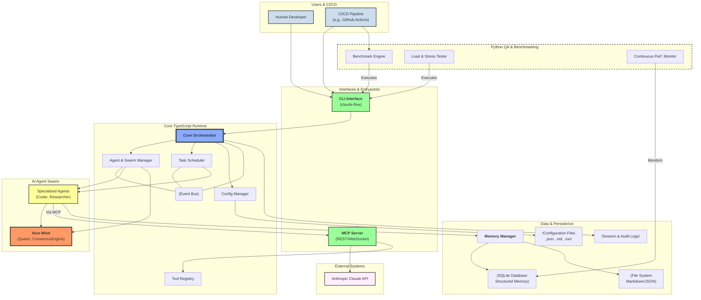

Of course. Based on the comprehensive analysis of all the provided files, here is a high-level architectural diagram of the Claude-Flow system presented in Mermaid Markdown format.

This diagram consolidates the TypeScript runtime, the Python quality assurance suite, the configuration and documentation layers, and their key interactions.

### **How to Read the Diagram**

The diagram is organized into logical swimlanes representing the major architectural domains:

1.  **Users & CI/CD (Initiators):** The external actors who trigger actions in the system.
2.  **Interfaces & Entrypoints:** The primary "front doors" to the application.
3.  **Claude-Flow Core System (TypeScript Runtime):** The central application logic.
4.  **AI Agent Swarm (Dynamic):** The pool of AI workers and their coordination layer.
5.  **Data & Persistence Layer:** Where state, configuration, and knowledge are stored.
6.  **External Systems & Integrations:** The key third-party services the system depends on.
7.  **Python QA & Benchmarking Suite:** The external system responsible for ensuring quality and performance.

Arrows indicate the primary direction of data flow or control.

***

### **Claude-Flow System Architecture Diagram**

