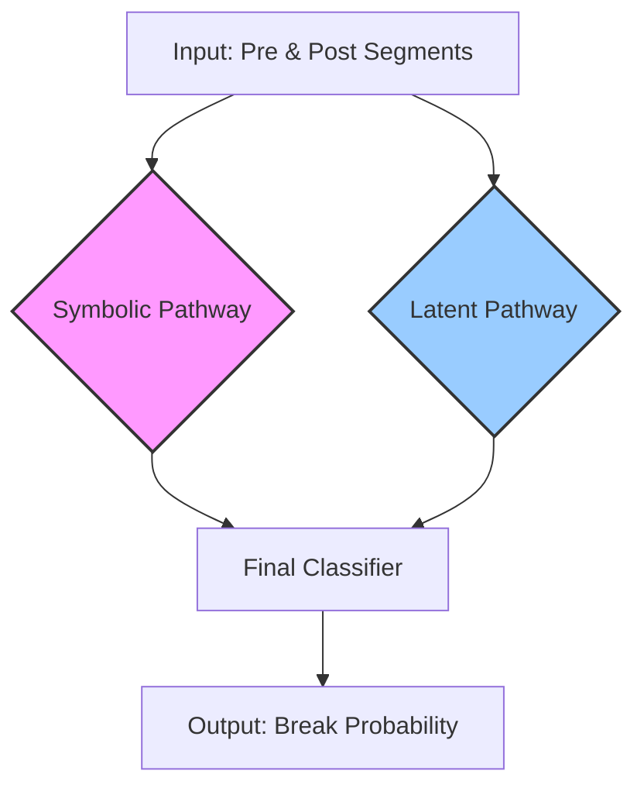

---

## **The Definitive CIv13/14 Project Roadmap**

This project is divided into three main stages: **I. Expert Encoder Pre-training**, **II. Full System Assembly & Training**, and **III. Evaluation & Analysis**.

### **Stage I: Expert Encoder Pre-training**
*(Goal: Forge the two specialized "brains" of our system by training them on idealized tasks.)*

#### **Phase 1: Pre-training the Symbolic Brain (The Causal Reasoner)**
*   **Objective:** To create an expert `SymbolicEncoder` that understands the **algebra of causal rules** and the emergence of complexity. This is the intensive curriculum we just designed.
*   **Actions:**
    1.  Define a curriculum based on **prime and composite ECA rules** (inspired by Riedel & Zenil).
    2.  Generate a rich dataset including single primes, two-rule compositions, and known decompositions of universal rules (like Rule 110).
    3.  Train our winning **Bi-GRU architecture** on a multi-task objective: predict the next state AND the generative rule ID.
*   **Deliverable:** A saved model file, `symbolic_encoder_expert.pth`, containing the weights of our trained Causal Rule Inference Engine.

#### **Phase 2: Pre-training the Latent Brain (The Dynamics Fingerprinter)**
*   **Objective:** To create an expert `LatentEncoder` that can generate rich, contextual "fingerprints" of raw time series dynamics.
*   **Actions:**
    1.  Use the **TS2Vec framework**.
    2.  Train the `TSEncoder` (or a similar architecture like a GRU) using the **hierarchical contrastive loss** on a large, unlabeled time series dataset. Ideally, this would be the unlabeled ADIA training data itself, allowing the encoder to learn the specific "feel" of the target domain.
*   **Deliverable:** A saved model file, `latent_encoder_expert.pth`, containing the weights of our trained Dynamics Fingerprinter.

---

### **Stage II: Full System Assembly & Training**
*(Goal: Integrate the two expert brains into the final Siamese architecture and train the decision-making head.)*

#### **Phase 3: Data Pipeline and Final Assembly**
*   **Objective:** To build the final model and the data pipeline that feeds it.
*   **Actions:**
    1.  Implement the final `ADIADualPathDataset`, which takes a real-world ADIA sample (`id`) and produces the four required inputs: `raw_A`, `symbolic_A` (using our `d=6, τ=10` symbolizer), `raw_B`, and `symbolic_B`.
    2.  Implement the definitive **`CIv14_DivergenceClassifier`**.
    3.  Instantiate the classifier, **loading the pre-trained weights** from `symbolic_encoder_expert.pth` and `latent_encoder_expert.pth` into the two respective encoder pathways.

#### **Phase 4: Head Fine-Tuning**
*   **Objective:** To train the final, small classifier head to interpret the divergence signals from the two expert encoders.
*   **Actions:**
    1.  **Freeze the weights** of both the Symbolic and Latent encoders. This is critical. We treat them as fixed, expert feature extractors.
    2.  Train *only* the final MLP `classifier_head` on the ADIA training data. The task is to learn the mapping from the concatenated `[symbolic_divergence, latent_divergence]` vector to a `break`/`no-break` prediction.
    3.  Use our weighted loss function to handle the class imbalance.
*   **Deliverable:** A saved model file, `CIv14_final_model.pth`, containing the weights for the entire system, with the trained head.

---

### **Stage III: Evaluation & Analysis**
*(Goal: Measure the final performance of our system and analyze its behavior.)*

#### **Phase 5: Final Evaluation**
*   **Objective:** To get the definitive, quantitative measure of our system's performance.
*   **Actions:**
    1.  Load the final, trained `CIv14_final_model.pth`.
    2.  Run inference on the held-out ADIA validation set.
    3.  Calculate the final **Validation AUC score**.
*   **Deliverable:** The single most important number of the project, telling us how well the CIv13/14 hypothesis performed.

#### **Phase 6: Analysis and Interpretation (Optional but Recommended)**
*   **Objective:** To understand *why* the model made its decisions.
*   **Actions:**
    1.  Analyze the model's predictions on specific `True` and `False` break examples.
    2.  For a given break, inspect the two divergence signals separately. Did the break get detected because the symbolic path fired, the latent path fired, or both? This directly tests the "misalignment" hypothesis.
    3.  This analysis would be the core of any report or paper written about this project.

This roadmap is complete, logical, and builds from foundational principles to a final, robust system. We are currently at the starting line of **Phase 1**.
---

### **Consolidated Training Plan: CIv14 Cybernetic Divergence Detector**

#### **1. Vision & Guiding Principles**

*   **Core Hypothesis (CIv13/14):** A structural break is a **misalignment** between a system's explicit **symbolic/causal grammar** and its implicit **latent/dynamic structure**. Our goal is to build a system that models both pathways and detects breaks by measuring their divergence.
*   **Architectural Principle (Dual-Stream Siamese):** The system will be a **dual-path Siamese network**. This architecture is purpose-built for comparison, directly modeling our hypothesis by processing a pre-break and post-break segment through two distinct, expert "brains."
*   **Training Philosophy (Experts First):** Naive models trained on noisy, real-world data from scratch fail (evidenced by AUC ≈ 0.5). Therefore, our strategy is to **pre-train expert encoders** in specialized, controlled environments before assembling them for the final fine-tuning task.
*   **Methodology (Systematic Validation):** We will follow a rigorous, **unit-to-integrated** testing plan to build, validate, and tune each component in isolation before final assembly.

---

#### **2. The Stepwise Execution Plan**

This is our phased roadmap for building and validating the final model.

| Phase | Target | Objective & Methodology | Status & Key Learnings |
| :--- | :--- | :--- | :--- |
| **Phase 0** | 🧪 **Symbolizer Calibration** | **Calibrate the Symbolic "Sensor."** Run the regression-style test harness on the real ADIA data to find the optimal `(d, τ)` parameters by maximizing Jensen-Shannon Divergence. | ✅ **COMPLETE.**   **Result:** The optimal, most sensitive parameters for the ADIA data are **`d=6, τ=10`**. We will proceed with this configuration. |
| **Phase 1** | 🧪 **Latent Brain & Baseline** | **Forge the Latent Encoder & Establish a Baseline.**   1. Pre-train a `TSEncoder` using the TS2Vec contrastive learning methodology on unlabeled data to create an expert in raw dynamics.   2. Test a "latent-only" Siamese model on the ADIA data to get a baseline AUC. | ✅ **COMPLETE.**   **Result:** A pre-trained `TSEncoder` is ready. The latent-only baseline is **AUC = 0.5024**, proving this path is insufficient alone. |
| **Phase 2** | 🧪 **Symbolic Brain & Baseline** | **Forge the Symbolic Encoder & Establish a Baseline.**   1. **(Bake-Off):** Empirically test Transformer vs. GRU architectures on an ECA rule-inference task.   2. **(Definitive Pre-training):** Train the winning architecture (GRU) on a complex, **composite rule dataset** based on **Sequential Rule Application** (`State(t+1) = Rule_B(Rule_A(State(t)))`) to forge a true expert in causal inference. | ✅ **Bake-Off Complete:** The **Unidirectional GRU** is the decisive winner (better accuracy, 2.4x faster).   ⏳ **NEXT: Definitive Pre-training** on the composite rule dataset. |
| **Phase 3**| 🧩 **Final Assembly & Fine-Tuning** | **Build and Train the Full CIv14 Model.**   1. Construct the `CIv14-DivergenceClassifier` with the two pre-trained expert encoders.   2. Create the `DualStreamDataset` to serve `(raw_A, symbolic_A, raw_B, symbolic_B)` tuples.   3. Freeze the encoders and train the final classifier head on the combined divergence signal.   4. (Optional) Unfreeze and fine-tune the entire system with a low learning rate. | 🔜 **PENDING.** This is the final step after both expert encoders are ready. |

---

#### **3. Final Architectural Blueprint**

This is the definitive architecture we will build in Phase 3.

---

### **4. Summary of Data Flow**

| Stage | Input Data | Model / Process | Output |
| :--- | :--- | :--- | :--- |
| **Phase 2 (Pre-training)**| Synthetic sequences from **composite ECA rules**. | **Symbolic Encoder (GRU)** | A pre-trained encoder that can **infer causal rules**. |
| **Phase 3 (Fine-tuning)**| Real ADIA data `(raw_A, sym_A, raw_B, sym_B)`.| **Full `CIv14-DivergenceClassifier`** | A final, trained model that outputs a **break probability**. |
| **Inference** | A new pair of segments from the test set. | The final trained model. | An AUC score on the test set. |

This consolidated plan provides a clear, logical, and evidence-based path from where we are now to the final, robust solution. It leverages all our key findings and ensures that each component is validated before integration.
