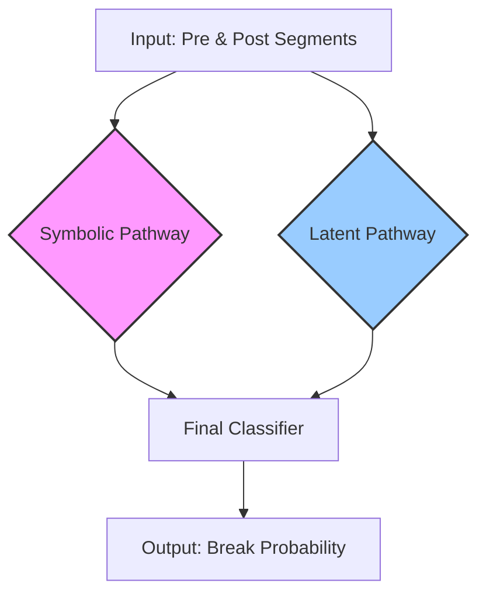

Excellent. This is the perfect time to consolidate our entire plan. We have moved from broad theories to specific, validated components and a clear architectural blueprint. A consolidated plan will serve as our definitive guide for the final assembly and execution.

Here is the **Consolidated Training Plan for the CIv14 Cybernetic Divergence Detector**, synthesizing all our discussions, experiments, and strategic decisions.

---

### **Consolidated Training Plan: CIv14 Cybernetic Divergence Detector**

#### **1. Vision & Guiding Principles**

*   **Core Hypothesis (CIv13/14):** A structural break is a **misalignment** between a system's explicit **symbolic/causal grammar** and its implicit **latent/dynamic structure**. Our goal is to build a system that models both pathways and detects breaks by measuring their divergence.
*   **Architectural Principle (Dual-Stream Siamese):** The system will be a **dual-path Siamese network**. This architecture is purpose-built for comparison, directly modeling our hypothesis by processing a pre-break and post-break segment through two distinct, expert "brains."
*   **Training Philosophy (Experts First):** Naive models trained on noisy, real-world data from scratch fail (evidenced by AUC ≈ 0.5). Therefore, our strategy is to **pre-train expert encoders** in specialized, controlled environments before assembling them for the final fine-tuning task.
*   **Methodology (Systematic Validation):** We will follow a rigorous, **unit-to-integrated** testing plan to build, validate, and tune each component in isolation before final assembly.

---

#### **2. The Stepwise Execution Plan**

This is our phased roadmap for building and validating the final model.

| Phase | Target | Objective & Methodology | Status & Key Learnings |
| :--- | :--- | :--- | :--- |
| **Phase 0** | 🧪 **Symbolizer Calibration** | **Calibrate the Symbolic "Sensor."** Run the regression-style test harness on the real ADIA data to find the optimal `(d, τ)` parameters by maximizing Jensen-Shannon Divergence. | ✅ **COMPLETE.**   **Result:** The optimal, most sensitive parameters for the ADIA data are **`d=6, τ=10`**. We will proceed with this configuration. |
| **Phase 1** | 🧪 **Latent Brain & Baseline** | **Forge the Latent Encoder & Establish a Baseline.**   1. Pre-train a `TSEncoder` using the TS2Vec contrastive learning methodology on unlabeled data to create an expert in raw dynamics.   2. Test a "latent-only" Siamese model on the ADIA data to get a baseline AUC. | ✅ **COMPLETE.**   **Result:** A pre-trained `TSEncoder` is ready. The latent-only baseline is **AUC = 0.5024**, proving this path is insufficient alone. |
| **Phase 2** | 🧪 **Symbolic Brain & Baseline** | **Forge the Symbolic Encoder & Establish a Baseline.**   1. **(Bake-Off):** Empirically test Transformer vs. GRU architectures on an ECA rule-inference task.   2. **(Definitive Pre-training):** Train the winning architecture (GRU) on a complex, **composite rule dataset** based on **Sequential Rule Application** (`State(t+1) = Rule_B(Rule_A(State(t)))`) to forge a true expert in causal inference. | ✅ **Bake-Off Complete:** The **Unidirectional GRU** is the decisive winner (better accuracy, 2.4x faster).   ⏳ **NEXT: Definitive Pre-training** on the composite rule dataset. |
| **Phase 3**| 🧩 **Final Assembly & Fine-Tuning** | **Build and Train the Full CIv14 Model.**   1. Construct the `CIv14-DivergenceClassifier` with the two pre-trained expert encoders.   2. Create the `DualStreamDataset` to serve `(raw_A, symbolic_A, raw_B, symbolic_B)` tuples.   3. Freeze the encoders and train the final classifier head on the combined divergence signal.   4. (Optional) Unfreeze and fine-tune the entire system with a low learning rate. | 🔜 **PENDING.** This is the final step after both expert encoders are ready. |

---

#### **3. Final Architectural Blueprint**

This is the definitive architecture we will build in Phase 3.

---

### **4. Summary of Data Flow**

| Stage | Input Data | Model / Process | Output |
| :--- | :--- | :--- | :--- |
| **Phase 2 (Pre-training)**| Synthetic sequences from **composite ECA rules**. | **Symbolic Encoder (GRU)** | A pre-trained encoder that can **infer causal rules**. |
| **Phase 3 (Fine-tuning)**| Real ADIA data `(raw_A, sym_A, raw_B, sym_B)`.| **Full `CIv14-DivergenceClassifier`** | A final, trained model that outputs a **break probability**. |
| **Inference** | A new pair of segments from the test set. | The final trained model. | An AUC score on the test set. |

This consolidated plan provides a clear, logical, and evidence-based path from where we are now to the final, robust solution. It leverages all our key findings and ensures that each component is validated before integration.
