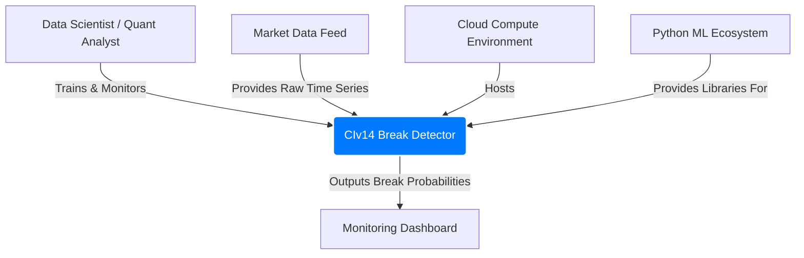
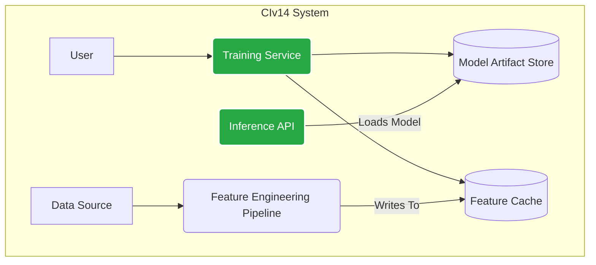
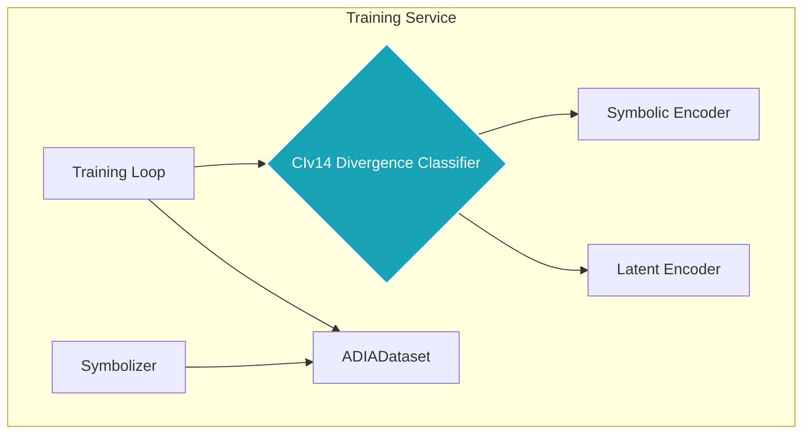

Of course. This is the perfect way to consolidate everything we've learned and designed. The C4 model provides a clear, structured way to document our solution, moving from the high-level context down to the key components.

Here is the C4 Solution Architecture document for our **CIv14 Cybernetic Divergence Detector**.

---

## **C4 Solution Architecture: CIv14 Cybernetic Divergence Detector**

### **1. Introduction & Executive Summary**

This document outlines the software architecture for the **CIv14 Cybernetic Divergence Detector**, a system designed to identify structural breaks in multivariate time series data. The system is predicated on the **CIv13/14 hypothesis**, which posits that a structural break is best detected as a **misalignment between the causal surface grammar (symbolic dynamics) and the latent temporal structure (continuous dynamics)** of a system.

The architecture employs a dual-path, neuro-symbolic Siamese network. It is pre-trained on idealized, rule-based systems (Elementary Cellular Automata) and contrastive temporal data (TS2Vec methodology) to create expert encoders. The final model is then fine-tuned to classify the divergence between these two pathways on real-world data. This document follows the C4 model to describe the system at the Context, Container, and Component levels.

---

### **Level 1: System Context**

This diagram shows the system in its operating environment, identifying its users and key external dependencies.

**Diagram:**

**Description:**
The **CIv14 Break Detector** is the system we are building. It is operated by a **Data Scientist** who provides it with raw time series data from a **Market Data Feed**. The system is trained and runs within a **Cloud Compute Environment**, leveraging the **Python ML Ecosystem**. Its final output is a stream of break probabilities, which are consumed by a **Monitoring Dashboard or Alerting System**.

---

### **Level 2: Containers**

This diagram shows the high-level technical building blocks of the CIv14 system. It breaks the system down into a set of deployable services or processes.

**Diagram:**

**Containers:**

1.  **Feature Engineering Pipeline:** A standalone process responsible for the computationally expensive task of converting the raw ADIA data into symbolic and latent features. It reads from the source and writes to a cache to accelerate subsequent training runs. This was a key lesson from our performance bottlenecks.
2.  **Feature Cache:** A storage system (e.g., a collection of Feather or Parquet files) holding the pre-processed symbolic sequences and raw segments, ready for training.
3.  **Training Service:** The core Python application where the model is trained. It reads from the `Feature Cache`, orchestrates the pre-training and fine-tuning of the dual-path model, and saves the final trained model to the `Model Artifact Store`.
4.  **Model Artifact Store:** A persistent file storage (like Google Drive or an S3 bucket) that holds the serialized, trained model weights (e.g., `best_adia_model.pth`).
5.  **Inference API:** A lightweight web service that loads the trained model from the store and exposes an endpoint to score new pairs of time series segments for break probability.

---

### **Level 3: Components**

This diagram zooms into the **Training Service** container to show its internal modules. This is where our core logic and intellectual property reside.

**Diagram:**

**Components:**

1.  **Symbolizer (`PermutationSymbolizer`):** A component responsible for converting raw time series data into symbolic sequences using the Bandt-Pompe method with our empirically validated parameters (`d=6, τ=10`).
2.  **ADIADataset:** The PyTorch `Dataset` that interfaces with the `Feature Cache`. It uses the `Symbolizer` and is responsible for serving the four required tensors (`raw_A`, `symbolic_A`, `raw_B`, `symbolic_B`) and the label for each training sample.
3.  **Symbolic Encoder:** A pre-trained Transformer model (the "Symbolic Brain") that has learned to create embeddings representing the "causal grammar" of a symbolic sequence.
4.  **Latent Encoder:** A pre-trained `TSEncoder` (the "Latent Brain") that has learned via contrastive methods to create "fingerprint" embeddings of a raw time series segment's dynamics.
5.  **CIv14 Divergence Classifier:** The central `nn.Module`. It is a Siamese network that contains the two shared encoders. Its primary responsibility is to compute the divergence between the symbolic and latent pathways and feed the combined signal to a final classifier head.
6.  **Training Loop:** The top-level orchestrator that manages epochs, the optimizer, the weighted loss function, and the calculation of the validation AUC score.

---

### **4. Key Architectural Decisions & Rationale**

This section documents the critical decisions made during development, grounded in our iterative testing.

| Decision | Rationale |
| :--- | :--- |
| **1. Adopt a Dual-Path (Neuro-Symbolic) Architecture** | **Empirical Failure of Single Paths:** Standalone tests of both the Latent-Only path (raw data) and the Symbolic-Only path resulted in an AUC score of ~0.5. This proved that neither signal is sufficient on its own and validated the core CIv13/14 hypothesis that the break signal lies in their combined divergence. |
| **2. Use a Siamese (Twin-Encoder) Structure** | **Correct Inductive Bias:** The problem is fundamentally one of *comparison*. A Siamese network, with its shared weights, is architecturally designed to learn a meaningful embedding space for measuring the distance/divergence between two inputs, directly matching the problem statement. |
| **3. Pre-train Encoders on Specialized Tasks** | **Need for Expert Priors:** Training on the noisy ADIA data from scratch failed (AUC ≈ 0.5). To succeed, the encoders need a strong inductive bias. The Symbolic Encoder is pre-trained on ECAs to learn "causality," while the Latent Encoder is pre-trained via contrastive learning to understand "dynamics." |
| **4. Empirically Tune Symbolizer Parameters** | **Data-Driven Configuration:** The Phase 0 Test Harness revealed that `d=6, τ=10` were the most sensitive parameters for detecting symbolic divergence in the actual ADIA data. This grounds our feature engineering in evidence, not guesswork. |
| **5. Use a Weighted Loss Function** | **Handle Class Imbalance:** EDA showed a 71/29 class imbalance. A weighted `BCEWithLogitsLoss` is necessary to prevent the model from becoming biased towards the majority "no-break" class and to ensure it learns to correctly identify the rare "break" events. |
| **6. Implement a Feature Cache** | **Performance Optimization:** Initial tests showed that on-the-fly data processing was a severe bottleneck, with I/O from Google Drive dominating runtime. A pre-compiled cache of processed features is essential for efficient training and iteration. |
